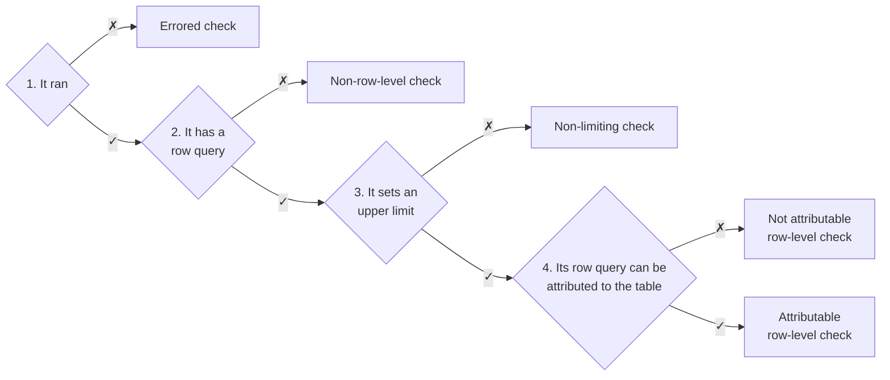
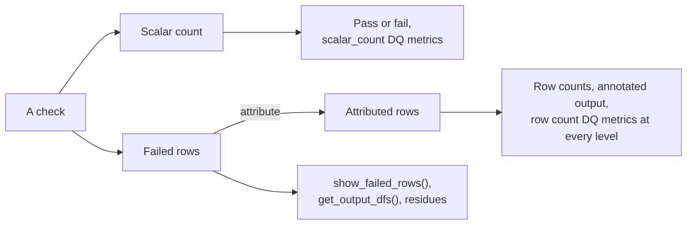
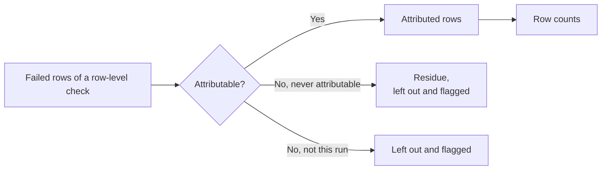

# Check Results

A check tells you whether your data passed. Often you also want to know which
rows broke it, and how many rows of the table are affected. This section
explains how vowl gets from a check to those answers:

| Page                                                          | What it covers                                                                 |
| ------------------------------------------------------------- | ------------------------------------------------------------------------------ |
| This page                                                     | The check result types, what a check gives you, and the scalar and row queries |
| [How Attributed Rows Work](how-attributed-rows-work.md)       | How vowl attributes failed rows and adds them up                               |
| [Counting Mechanisms](counting-mechanisms.md)                 | The routes vowl uses to attribute rows, and what each one costs                |
| [Annotating the Source Table](annotating-the-source-table.md) | How vowl writes the attributed rows into your table                            |
| [Capping Failed Rows](capping-failed-rows.md)                 | What changes when you limit how many failed rows vowl downloads                |

Words such as **failed rows** and **row counts** are defined in the
[Glossary](../../glossary.md).

## Check result types {#counted-checks}

A check passes or fails on its scalar count. A **failed check** is a check
with the status `FAILED`, because its scalar count broke its limit.
{#failed-checks}

A failed check tells you the table did not pass. The row counts answer a
second question: how many rows of the table have issues? Only some checks can
help answer it, depending on their type.

vowl puts each check through four conditions, in order. The first condition a
check fails sets its type:



| Type                                                                  | Description                                                                     |
| --------------------------------------------------------------------- | ------------------------------------------------------------------------------- |
| [Errored check](#errored-check)                                       | The check could not run. You get a message on why.                              |
| [Non-row-level check](#non-row-level-check)                           | The check returns one number, such as an average. No row is at fault.           |
| [Non-limiting check](#non-limiting-check)                             | The check counts rows, but a high count is not bad.                             |
| [Not attributable row-level check](#not-attributable-row-level-check) | The check returns rows with issues, but vowl can't attribute them to the table. |
| [Attributable row-level check](#attributable-row-level-check)         | The check returns rows with issues, and vowl attributes each to the table.      |

Only attributable row-level checks that failed add rows to the row counts.
`get_dq_metrics_df(by="check")` shows the type of each check in its
`row_level`, `route` and `reason` columns. A check passes or fails as usual
whatever its type, and a passed check can be row-level too. By default vowl
does not attribute a passed check (see [Tolerated rows](#tolerated-rows)).

### Errored check {#errored-check}

The check could not run, so it has no scalar count and no failed rows. The
`message` column of `get_check_results_df()` says why.

!!! example "Example: an errored check"

    `quantity_is_filled` points at a column that does not exist:

    | check_name           | status  | message                       |
    | -------------------- | ------- | ----------------------------- |
    | `quantity_is_filled` | `ERROR` | `column "qty" does not exist` |

If the check would have been row-level, it may have had failed rows that vowl
never saw. The row counts of its table and dimension are then marked
[not exact](counting-mechanisms.md#exact-numbers).

`reason`: `check ended in ERROR`

### Non-row-level check {#non-row-level-check}

The check returns one number that is not a count of rows, so no row is at
fault.

!!! example "Example: a non-row-level check"

    `average_price_in_range` runs:

    ```sql
    SELECT AVG(price) FROM orders
    ```

    | AVG(price) |
    | ---------- |
    | 0.14       |

A SQL check points at rows when its query holds one `COUNT`, such as
`COUNT(*)`, `COUNT(quantity)` or `COUNT(DISTINCT item)`, or lists rows with
no aggregate. These checks don't:

| Check                                       | Example                                                 |
| ------------------------------------------- | ------------------------------------------------------- |
| An aggregate other than `COUNT`             | `SELECT AVG(price) FROM orders`, or `SUM`, `MIN`, `MAX` |
| More than one aggregate                     | `SELECT COUNT(*), MAX(price) FROM orders`               |
| A distinct count of combined values         | `SELECT COUNT(DISTINCT (item, price)) FROM orders`      |
| A query vowl can't parse, or with no `FROM` | `SELECT 1`                                              |
| A `unit` other than `rows`                  | `unit: percent`                                         |
| A check type with no SQL behind it          | Custom and unsupported check types                      |

`reason`: `not a row-level check`

### Non-limiting check {#non-limiting-check}

The check counts rows, but a high count is not bad. Its rows are not rows with
issues.

!!! example "Example: a non-limiting check"

    Say a check needs at least 3 orders with a price above 0:

    ```sql
    SELECT COUNT(*) FROM orders WHERE price > 0
    -- mustBeGreaterOrEqualTo: 3
    ```

    | order_id | item  | price | quantity |
    | -------- | ----- | ----- | -------- |
    | 1        | apple | 1.50  | 3        |
    | 4        | eggs  | 3.20  | 2        |

    The count is 2, so the check fails. But apple and eggs are the good rows.

A check only points at rows with issues when its operator means "no more than
this many":

| Operator                                                                                            | Sets an upper limit                                              |
| --------------------------------------------------------------------------------------------------- | ---------------------------------------------------------------- |
| `mustBe: 0`                                                                                         | Yes. No failed row is allowed.                                   |
| `mustBeLessThan`, `mustBeLessOrEqualTo`, `mustBeBetween: [0, n]`                                    | Yes. Some failed rows are allowed.                               |
| `mustBeGreaterThan`, `mustBeGreaterOrEqualTo`                                                       | No. The check counts good rows, such as "at least 100 are paid". |
| `mustBe: n` with n above 0, `mustNotBe`, `mustBeBetween: [a, b]` with a above 0, `mustNotBeBetween` | No. When the total is off, no single row is at fault.            |

`reason`: `operator does not set an upper limit`

### Not attributable row-level check {#not-attributable-row-level-check}

The check returns rows with issues, but vowl can't tell which row of the table
each one stands for.

!!! example "Example: a not attributable row-level check"

    Say a check returns only the `item` column:

    ```sql
    SELECT item FROM orders WHERE price <= 0
    ```

    | item  |
    | ----- |
    | bread |
    | milk  |
    | bread |

    The two bread rows could be any of the bread rows in `orders`.

A check can be not attributable in two ways:

| Kind                          | When                                                                                                                                                                                                                                                                                                                                                                  | Its failed rows                                                  |
| ----------------------------- | --------------------------------------------------------------------------------------------------------------------------------------------------------------------------------------------------------------------------------------------------------------------------------------------------------------------------------------------------------------------- | ---------------------------------------------------------------- |
| **Never attributable**        | Its failed rows lack the [match key](how-attributed-rows-work.md#the-match-key). This happens on every run.                                                                                                                                                                                                                                                           | Become a [residue](annotating-the-source-table.md#residues)      |
| **Not attributable this run** | Its failed rows have the match key, but something went wrong on this run. The table or the failed rows could not be downloaded, the values could not be turned into match keys, [`max_failed_rows`](capping-failed-rows.md) cut the failed rows short, or its row query failed in the data source. See [When something goes wrong](counting-mechanisms.md#fallbacks). | Are annotated as usual, unless the table could not be downloaded |

See [Attributed rows](#from-query-output-to-row-counts) for every reason.

The check still has a scalar count, reported in
`vowl.check.row.scalar_count`. It has no `vowl.check.row.count`, and it adds
nothing to the row counts of its dimension, its schema or the run, and
`checks_not_attributable` counts it.

### Attributable row-level check {#attributable-row-level-check}

The check returns rows with the
[match key](how-attributed-rows-work.md#the-match-key): every column of the
table, or its primary key. vowl attributes each one to a row of the table.
These are its **attributed rows**: exactly which rows of the table have
issues.

!!! example "Example: an attributable row-level check"

    `quantity_is_filled` runs:

    ```sql
    SELECT * FROM orders WHERE quantity IS NULL
    ```

    | order_id | item | price | quantity |
    | -------- | ---- | ----- | -------- |
    | 3        | milk | 0.00  |          |

    The failed row has every column of `orders`, so vowl finds the row of
    `orders` with the same values. It is row 3:

    | Row   | order_id | item     | price    | quantity |
    | ----- | -------- | -------- | -------- | -------- |
    | 1     | 1        | apple    | 1.50     | 3        |
    | 2     | 2        | bread    | -2.00    | 1        |
    | **3** | **3**    | **milk** | **0.00** |          |
    | 4     | 4        | eggs     | 3.20     | 2        |
    | 5     | 2        | bread    | -2.00    | 1        |

    `order_id` alone is not enough here, because rows 2 and 5 share
    `order_id` 2. If the contract declared `order_id` as a primary key with no
    repeats, a failed row would only need `order_id`.

#### Tolerated rows {#tolerated-rows}

A **tolerated row** is a failed row of a row-level check that passed.

!!! example "Example: a tolerated row"

    Say `quantity_is_filled` allows fewer than 2 empty quantities:

    ```sql
    SELECT COUNT(*) FROM orders WHERE quantity IS NULL
    -- mustBeLessThan: 2
    ```

    | order_id | item | price | quantity |
    | -------- | ---- | ----- | -------- |
    | 3        | milk | 0.00  |          |

    Its scalar count is 1, so it passes, and milk is a tolerated row.

    By default the completeness dimension has `failed_rows` 0. With
    `attribute_tolerated_rows=True`, it has `failed_rows` 1. If milk also
    fails a check that failed, such as `price_must_be_positive`, the totals
    for `orders` don't change either way.

A passed check still reports its scalar count in
`vowl.check.row.scalar_count`. Its `vowl.check.row.count` follows the same
rule as its tolerated rows: `FAILED` is 0 by default, and its attributed rows
with `attribute_tolerated_rows=True`. By default vowl does not attribute its rows. It runs no extra query for it,
adds nothing to the row counts and does not flag it in the annotated output.
Its `reason` is `passed, not attributed`, and it is not counted in
`checks_not_attributable`.

[`attribute_tolerated_rows`](../../run-settings.md#attribute_tolerated_rows)
attributes passed checks too, so the row counts hold every row that broke a
row-level check, whatever the tolerance. You set it per run, not in the
contract:

```python
from vowl import ValidationConfig, validate_data

config = ValidationConfig(attribute_tolerated_rows=True)
result = validate_data("orders.yaml", df=df, config=config)
```

`check_info` in the annotated output then also lists the passed checks a row
broke. Their items carry `"tolerated": true`, so you can tell them apart from
failed checks.

!!! example "Example: a tolerated check in `check_info`"

    With `attribute_tolerated_rows=True`, the milk row of `orders` lists both
    checks it broke:

    | order_id | item | check_info                                                                                     |
    | -------- | ---- | ---------------------------------------------------------------------------------------------- |
    | 3        | milk | `[{"check_name": "price_must_be_positive"}, {"check_name": "quantity_is_filled", "tolerated": true}]` |

    `quantity_is_filled` passed, so its item is marked tolerated.

A passed check is attributed the same way as a failed one, so it can need the
table downloaded. The failed checks of that table then take `client_lookup`
too (see [Counting Mechanisms](counting-mechanisms.md)).

## What a check gives you {#failed-row-results}

Every check gives its **query output**: the **scalar count** and the
**failed rows**. vowl then attributes the failed rows to get the
**attributed rows**. Each one feeds a different part of the results:



| Result              | Where you see it                                                                                     |
| ------------------- | ---------------------------------------------------------------------------------------------------- |
| **Scalar count**    | `actual` in the summary, `failed_rows_count`, `scalar_count` in `get_dq_metrics_df(by="check")`      |
| **Failed rows**     | `show_failed_rows()`, `get_output_dfs()`, residues                                                   |
| **Attributed rows** | `attributed_rows` in `get_dq_metrics_df(by="check")`, and `failed_rows` per schema and per dimension |

### Scalar and row queries {#two-queries-from-one}

You write one query per SQL check, and vowl gets two queries out of it. One
returns the scalar count, and the other returns the failed rows.

| Query            | What it returns                      | When it runs                                      |
| ---------------- | ------------------------------------ | ------------------------------------------------- |
| **Scalar query** | The number that decides pass or fail | Always                                            |
| **Row query**    | The rows behind that number          | Only when the check fails and the rows are needed |

The row query returns the rows of its own result. They are rows of the source
table only when the query is a plain filter of that table. A `DISTINCT`, a
`GROUP BY` or a join changes what its rows are, and that decides whether vowl
can [attribute](#attributable-row-level-check) them. A check
that returns an average, a sum, a minimum or a maximum has no row query.

You can write either one, and vowl builds the other:

=== "You write `COUNT(*)`"

    ```sql
    -- Your query (scalar query): decides pass or fail
    SELECT COUNT(*) FROM orders WHERE price <= 0

    -- vowl builds the row query by replacing COUNT(*) with *
    SELECT * FROM orders WHERE price <= 0
    ```

=== "You write `SELECT *`"

    ```sql
    -- Your query (row query): lists the rows
    SELECT * FROM orders WHERE price <= 0

    -- vowl builds the scalar query by wrapping it in COUNT(*)
    SELECT COUNT(*) FROM (SELECT * FROM orders WHERE price <= 0)
    ```

So a check written as `COUNT(*)` with `mustBe: 0` still gives you the rows
behind the count. This works for a check that joins two tables too, such as
"every payroll row has a matching employee":

```sql
SELECT COUNT(*)
FROM demo_employee_payroll payroll
LEFT JOIN demo_employee_list ref
  ON payroll.employee_id = ref.employee_id
WHERE ref.employee_id IS NULL
```

The scalar query tells you that _some_ payroll rows have no matching employee.
The row query tells you _which_ ones. The columns those rows hold
depend on how the query is written, and decide whether vowl can attribute
them to the source table. See
[Annotating the failed rows of a cross-table check](../cross-table/how-it-works.md#annotating-the-failed-rows-of-a-cross-table-check).

!!! info "How vowl builds the other query"

    vowl does not search and replace the text `COUNT(*)`. It reads your query
    with [sqlglot](https://github.com/tobymao/sqlglot), a Python library that
    parses and translates SQL, and swaps the selected columns in the parsed
    query. Subqueries, `WITH` clauses and syntax specific to one database come
    through unchanged.

#### When each query runs

The scalar query always runs, because vowl needs it to pass or fail the check.
A check that passes costs one query.

The row query runs when a check fails and something needs its rows:

- The [row counts](how-attributed-rows-work.md), such as **Passed Rows**
  in the summary and `get_dq_metrics_df()`. Where it can, vowl runs the
  row queries inside the data source as part of one attribution query,
  so only numbers come back.
- The [annotated output](annotating-the-source-table.md), from
  `get_annotated_output()` or `save()`.
- `show_failed_rows()` and `get_output_dfs()`.

!!! info "Query performance"

    The wrapping vowl adds, a subquery or `SELECT *` in place of `COUNT(*)`,
    does not slow the query down. Databases flatten these standard shapes
    when they plan the query. A `LEFT JOIN ... WHERE ref.key IS NULL`, which
    finds rows with no match in the other table, usually runs as one pass
    over the join key. By default the row query returns every failed
    row. On a very large table with many failed rows, see
    [Capping Failed Rows](capping-failed-rows.md).

### Attributed rows {#from-query-output-to-row-counts}

The query output can't give the row counts on its own, because a row can fail
more than one check.

!!! example "Example: adding up the scalar counts"

    Three checks run on an `orders` table. A ✗ marks a failed row of the
    check:

    | Row | order_id | item  | price | quantity | `price_must_be_positive` | `quantity_is_filled` | `order_id_is_unique` |
    | --- | -------- | ----- | ----- | -------- | ------------------------ | -------------------- | -------------------- |
    | 1   | 1        | apple | 1.50  | 3        |                          |                      |                      |
    | 2   | 2        | bread | -2.00 | 1        | ✗                        |                      | ✗                    |
    | 3   | 3        | milk  | 0.00  |          | ✗                        | ✗                    |                      |
    | 4   | 4        | eggs  | 3.20  | 2        |                          |                      |                      |
    | 5   | 2        | bread | -2.00 | 1        | ✗                        |                      | ✗                    |

    Rows 2, 3 and 5 each fail more than one check:

    | Check                    | Scalar count | Rows of `orders` |
    | ------------------------ | ------------ | ---------------- |
    | `price_must_be_positive` | 3            | 2, 3, 5          |
    | `quantity_is_filled`     | 1            | 3                |
    | `order_id_is_unique`     | 2            | 2, 5             |
    | Total                    | 6            | 2, 3, 5          |

    The scalar counts add up to 6, but only 3 rows have issues.

A check can also change the rows it returns, for example with `DISTINCT` or a join (see
[Checks can change the rows they return](how-attributed-rows-work.md#checks-can-change-the-rows-they-return)).

So vowl attributes each failed row to a row of the table, then counts each
row once per dimension, schema and run:



| Kind of not attributable      | `reason`                                                                                                                                                                                                    | Annotated output                                                                             |
| ----------------------------- | ----------------------------------------------------------------------------------------------------------------------------------------------------------------------------------------------------------- | -------------------------------------------------------------------------------------------- |
| **Never attributable**        | `failed rows do not have the table's columns or primary key`, `primary key has duplicate values`, `primary key uniqueness could not be checked`                                                             | The failed rows become a residue                                                             |
| **Not attributable this run** | `truncated by max_failed_rows`, `the table could not be exported`, `the failed rows could not be fetched`, `the failed rows could not be turned into match keys`, `its row query failed in the data source` | Annotated as usual. When the table could not be downloaded, the failed rows become a residue |

See [The match key](how-attributed-rows-work.md#the-match-key) and
[When something goes wrong](counting-mechanisms.md#fallbacks) for each
reason.

A check that is not attributable has a `reason`, an empty `route` and no
`attributed_rows`. If it may have failed rows, the row counts
of its dimension, its schema and the run are marked not
[exact](counting-mechanisms.md#exact-numbers). When every row-level check of a
dimension or schema is not attributable, its numbers show N/A.

Each grain of the [DQ metrics](../../dq-metrics/understanding-metrics.md)
uses one number:

| Grain                     | Uses                                                                |
| ------------------------- | ------------------------------------------------------------------- |
| Check                     | Attributed rows. The scalar count is in `scalar_count`              |
| Dimension, schema and run | Attributed rows only. Checks that are not attributable are left out |

A check that is not attributable has no check-level `row.count`. Its scalar
count is still in `vowl.check.row.scalar_count`.

!!! warning "Breaking change"

    Check-level `row.count` and `row.pass_rate` used to use the scalar count.
    They now use attributed rows, like the other grains. See
    [How rows are counted](../../dq-metrics/understanding-metrics.md#how-failed-rows-are-counted).

`checks_not_attributable` counts the checks left out. It is a column of
`get_dq_metrics_df()`, the `vowl.row_quality.checks_not_attributable`
attribute of the OTEL root span, and a note in the
summary: `Passed Rows: 4 / 5 (80.0%) (approx., 2 checks not attributable)`.
