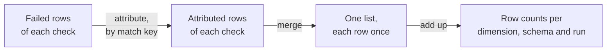

# How Attributed Rows Work

[Attributed rows](check-results.md#from-query-output-to-row-counts) showed
that the scalar counts of the `orders` table add up to 6, but only 3 rows
failed. This page explains how vowl gets from 6 to 3.



## Difficulties with attributing rows {#why-counting-failed-rows-is-hard}

| Difficulty                                          | Example                                                              | How vowl handles it                                                                                                                   |
| --------------------------------------------------- | -------------------------------------------------------------------- | ------------------------------------------------------------------------------------------------------------------------------------- |
| One row can fail several checks                     | The milk row fails `price_must_be_positive` and `quantity_is_filled` | Counts each row once per level. See [Levels of row counts](#grains-of-failed-row-counts)                                              |
| A check can change the rows it returns              | `DISTINCT` drops copies, a join repeats rows                         | Attributes each failed row to the source table. See [Checks can change the rows they return](#checks-can-change-the-rows-they-return) |
| Failed rows can lack columns of the source table    | `SELECT line_id, price FROM orders WHERE ...`                        | Uses the primary key as the [match key](#the-match-key), or leaves the check out                                                      |
| Attributing costs extra queries or a table download | A `DISTINCT` check needs a lookup in the source table                | Picks the cheapest [attribution method](counting-mechanisms.md) per check. A plain filter needs no lookup                             |

## Levels of row counts {#grains-of-failed-row-counts}

This page uses the `orders` table from
[Attributed rows](check-results.md#from-query-output-to-row-counts). A ✗ marks
a failed row of the check. Rows 2 and 5 are exact copies.

| Row | order_id | item  | price | quantity | `price_must_be_positive` | `quantity_is_filled` | `order_id_is_unique` |
| --- | -------- | ----- | ----- | -------- | ------------------------ | -------------------- | -------------------- |
| 1   | 1        | apple | 1.50  | 3        |                          |                      |                      |
| 2   | 2        | bread | -2.00 | 1        | ✗                        |                      | ✗                    |
| 3   | 3        | milk  | 0.00  |          | ✗                        | ✗                    |                      |
| 4   | 4        | eggs  | 3.20  | 2        |                          |                      |                      |
| 5   | 2        | bread | -2.00 | 1        | ✗                        |                      | ✗                    |

vowl gives row counts at four levels. Above the check level, each row counts
once:

| Level         | Counts                                                  | In the example                                                                | Where to see it                                                                                                                                               |
| ------------- | ------------------------------------------------------- | ----------------------------------------------------------------------------- | ------------------------------------------------------------------------------------------------------------------------------------------------------------- |
| **Check**     | The attributed rows of one row-level check              | `price_must_be_positive`: 3, `quantity_is_filled`: 1, `order_id_is_unique`: 2 | `attributed_rows` in `get_dq_metrics_df(by="check")`, and the check-level [DQ metrics](../../dq-metrics/understanding-metrics.md#how-failed-rows-are-counted) |
| **Dimension** | The rows that fail any row-level check of the dimension | conformity: 3, completeness: 1, uniqueness: 2                                 | `get_dq_metrics_df(by="dimension")`                                                                                                                           |
| **Schema**    | The rows that fail any row-level check of the table     | 3 of 5                                                                        | `get_dq_metrics_df()`                                                                                                                                         |
| **Run**       | The schema row counts added up                          | 3 of 5                                                                        | The run-level [DQ metrics](../../dq-metrics/understanding-metrics.md)                                                                                         |

Every level uses attributed rows. A check that is
[not attributable](#when-a-check-is-not-attributable) is left out, and its
scalar count is only in `scalar_count`. A check that is not row-level, such as
an average, has no row counts at any level.

## Attributing failed rows to the source table {#counts-are-exact-only-when-attributed-to-the-source-table}

To count each row once, vowl finds the rows of the source table that each
failed row stands for. This is **attributing** the failed row, and the rows
found are the check's **attributed rows**. Row counts are exact only when
every row-level check is attributed.

### Checks can change the rows they return

A plain filter returns rows of the source table as they are. Other queries
change them, so the three results of a check can differ:

| Query                                            | Scalar count | Failed rows | Attributed rows | Why                            |
| ------------------------------------------------ | ------------ | ----------- | --------------- | ------------------------------ |
| `SELECT * FROM orders WHERE price <= 0`          | 3            | 3           | 3               | A plain filter                 |
| `SELECT DISTINCT * FROM orders WHERE price <= 0` | 2            | 2           | 3               | `DISTINCT` drops one bread row |
| A join that matches row 3 twice                  | 4            | 4           | 3               | The join repeats a row         |

The row counts use attributed rows, so all three queries give the same 3
rows: 2, 3 and 5.

??? example "Example: a `COUNT(DISTINCT ...)` check"

    A `COUNT(DISTINCT ...)` check counts values, not rows:

    ```sql
    SELECT COUNT(DISTINCT item) FROM orders WHERE price <= 0
    ```

    | Result          | Value | What it counts                    |
    | --------------- | ----- | --------------------------------- |
    | Scalar count    | 2     | The values bread and milk         |
    | Attributed rows | 3     | Rows 2, 3 and 5, which hold them  |

    A check with no `WHERE`, such as `SELECT COUNT(DISTINCT item) FROM orders`
    with `mustBeLessThan: 3`, fails because the table has too many distinct
    items, not because one row is wrong. vowl still attributes every row with
    an `item`, so the row counts and the annotated output mark every such row
    as failed.

### Counts from separate checks don't add up

The [summary](../../results.md#print-a-report) is the report that
`print_summary()` prints and `save()` writes to `<prefix>_summary.json` (see
an [example output](../../getting-started.md#validate-in-3-lines)). Two of its
numbers are each check's scalar count added together:

| Summary number                | Where in the summary | Total of the scalar counts of                    |
| ----------------------------- | -------------------- | ------------------------------------------------ |
| **Failed Rows (approximate)** | **Overall**          | Every failed row-level check of the table        |
| **Non-unique Failed Rows**    | **Multi Table**      | Every failed check that also reads another table |

These totals don't account for overlap, so a row that fails two checks is
counted twice. For the `orders` table:

| Source                        | Failed rows | Why                                    |
| ----------------------------- | ----------- | -------------------------------------- |
| **Failed Rows (approximate)** | 6           | 3 + 1 + 2. Rows 2, 3 and 5 count twice |
| `get_dq_metrics_df()`         | 3           | Rows 2, 3 and 5, each counted once     |

To count each failed row once, use `get_dq_metrics_df()`.

??? example "Example: two Multi Table checks"

    `orders` has two checks that also read the `customers` table. `customers`
    holds customer 10 (country `SG`) and customer 30 (country `XX`, which is
    not a known country). Customer 20 does not exist.

    | order_id | customer_id | `customer_must_exist` | `customer_country_known` |
    | -------- | ----------- | --------------------- | ------------------------ |
    | 1        | 10          |                       |                          |
    | 2        | 20          | ✗ (no customer 20)    | ✗ (no country)           |
    | 3        | 30          |                       | ✗ (`XX`)                 |
    | 4        | 10          |                       |                          |

    Order 2 fails both checks:

    | Check                    | Scalar count | Failed orders |
    | ------------------------ | ------------ | ------------- |
    | `customer_must_exist`    | 1            | 2             |
    | `customer_country_known` | 2            | 2, 3          |
    | Total                    | 3            | 2, 3          |

    The summary shows the total of the scalar counts, 3:

    ```text
    orders:
      Overall:
        Failed Rows (approximate): 3
      Multi Table:
        Non-unique Failed Rows:    3
    ```

    `get_dq_metrics_df()` counts each failed order once, so it shows 2.

### The match key

vowl attributes a failed row by comparing the columns of the **match key**.
A failed row stands for every row of the source table with the same values
in all match key columns.

| Match key           | Used when                                                                                                                                                                                                                                 |
| ------------------- | ----------------------------------------------------------------------------------------------------------------------------------------------------------------------------------------------------------------------------------------- |
| **The primary key** | All three are true: the contract declares a primary key (`primaryKey: true`) that is not every column, the [data source can count](counting-mechanisms.md#which-route-a-check-takes) for the check, and no key value repeats in the table |
| **Every column**    | Otherwise                                                                                                                                                                                                                                 |

Both give the same row counts. The primary key is faster, and it can
attribute failed rows that hold only some columns. A check whose failed rows
lack a match key column is [never attributable](#when-a-check-is-not-attributable).

??? example "Example: failed rows with only some columns"

    Say `orders` has a `line_id` primary key with no repeats, and this check
    returns only two columns:

    ```sql
    SELECT line_id, price FROM orders WHERE price < 0
    ```

    | line_id | price |
    | ------- | ----- |
    | 2       | -2.00 |
    | 5       | -2.00 |

    | Match key    | Result                                                                                   |
    | ------------ | ---------------------------------------------------------------------------------------- |
    | Every column | The failed rows lack `order_id`, `item` and `quantity`. The check is not attributable    |
    | `line_id`    | The failed rows are rows 2 and 5. The check is attributable                              |

#### When two values count as the same {#how-values-are-compared}

Most values are equal or not. These cases may be unexpected:

| Values in a match key column      | Same? | Why                                                      |
| --------------------------------- | ----- | -------------------------------------------------------- |
| empty (`NULL`) and empty (`NULL`) | Yes   | So copies of a row with an empty value, like milk, match |
| `NaN` and `NaN`                   | Yes   | Same as empty values                                     |
| `a` and `A`                       | No    | Even in a column set to ignore case                      |
| `0.0` and `-0.0`                  | No    | Some databases keep them apart                           |
| `[1, 2]` and `[1, 3]`             | No    | Lists and nested values must match item by item          |
| Two times a nanosecond apart      | No    | Times must match exactly                                 |

vowl compares values this way in the data source and on your machine. This
is tested on DuckDB, SQLite, Spark, Databricks and PostgreSQL, the
**tested sources**. On another data source, `a` and `A` may count as the
same, so its row counts are marked approximate.

### When a check is not attributable

A row-level check that vowl can't attribute is **not attributable**. The
`attribution_note` column of `get_dq_metrics_df(by="check")` says why:

| `attribution_note`                                           | Not attributable | Meaning                                                                                                              |
| ------------------------------------------------------------ | ---------------- | -------------------------------------------------------------------------------------------------------------------- |
| `failed rows do not have the table's columns or primary key` | Never            | The failed rows lack a match key column. Or they hold the primary key, but the data source can't count for the check |
| `primary key has duplicate values`                           | Never            | A primary key value repeats in the table                                                                             |
| `primary key uniqueness could not be checked`                | Never            | The data source could not say whether a primary key value repeats                                                    |
| `truncated by max_failed_rows`                               | This run         | [`max_failed_rows`](capping-failed-rows.md) cut the failed rows short                                                |
| `the table could not be downloaded`                          | This run         | vowl could not download the source table                                                                             |
| `the failed rows could not be fetched`                       | This run         | vowl could not download the failed rows                                                                              |
| `the table's rows could not be turned into match keys`       | This run         | Values of the source table could not be turned into match keys                                                       |
| `its row query failed in the data source`                    | This run         | The row query failed inside the attribution query                                                                    |

See [When something goes wrong](counting-mechanisms.md#fallbacks) for the
reasons that apply to this run only.

A check that is not attributable has an `attribution_note`, an empty `attribution_method` and no
`attributed_rows`. Its effect on each output:

| Output                                                                                          | Never attributable                                                          | Not attributable this run                                                 |
| ----------------------------------------------------------------------------------------------- | --------------------------------------------------------------------------- | ------------------------------------------------------------------------- |
| Row counts                                                                                      | Left out. Marked approximate if the check may have failed rows              | Same                                                                      |
| Check-level [DQ metrics](../../dq-metrics/understanding-metrics.md#how-failed-rows-are-counted) | No `row.count`. The scalar count is in `vowl.check.row.scalar_count`        | Same                                                                      |
| [Annotated output](annotating-the-source-table.md)                                              | The failed rows become a [residue](annotating-the-source-table.md#residues) | Annotated as usual. A residue if the source table could not be downloaded |

When every row-level check of a dimension or schema is not attributable, its
row counts show N/A.

`checks_not_attributable` counts these checks. It is a column of
`get_dq_metrics_df()` and the `row.checks_not_attributable`
attribute of the OTEL root span. The summary does not show it.

## How the row counts are put together {#how-the-numbers-are-put-together}

vowl builds the row counts of each table in five steps:

| Step | What vowl does                                                                                                                     |
| ---- | ---------------------------------------------------------------------------------------------------------------------------------- |
| 1    | Attributes the failed rows of each row-level check, using one of the [attribution methods](counting-mechanisms.md#the-four-routes) |
| 2    | [Merges](#merging-the-failed-rows) the attributed rows of all checks into one list, by match key                                   |
| 3    | [Counts the rows](#counting-the-tables-rows) of the source table                                                                   |
| 4    | [Adds up](#adding-up-per-dimension-and-schema) the row counts per dimension and per schema                                         |
| 5    | Marks row counts that may be off as [approximate](counting-mechanisms.md#exact-numbers)                                            |

### Merging the attributed rows {#merging-the-failed-rows}

A data source can't point to "row 2" or "row 5" when both hold the same
values. It can only say "this bread row appears twice". So vowl merges
**distinct rows**: all rows with the same match key values, with their number
of **copies**.

```text
 Rows of the source table                 Distinct rows
 ─────────────────────────────            ──────────────────────
 row 2   2  bread  -2.00  1   ─┐
                               ├──────▶   bread    2 copies
 row 5   2  bread  -2.00  1   ─┘
 row 3   3  milk    0.00      ────────▶   milk     1 copy
```

Each distinct row appears once in the merged list, with the checks it failed.
Its copies are the highest number any check found, not the sum:

| Check                    | bread        | milk       |
| ------------------------ | ------------ | ---------- |
| `price_must_be_positive` | 2 copies     | 1 copy     |
| `quantity_is_filled`     |              | 1 copy     |
| `order_id_is_unique`     | 2 copies     |            |
| **Merged**               | **2 copies** | **1 copy** |

| Distinct row | Checks it failed                               | Copies |
| ------------ | ---------------------------------------------- | ------ |
| bread        | `price_must_be_positive`, `order_id_is_unique` | 2      |
| milk         | `price_must_be_positive`, `quantity_is_filled` | 1      |

So 3 rows of the source table failed.

??? note "Where the merge runs"

    | Case                                        | Where the merge runs                                                                                  |
    | ------------------------------------------- | ----------------------------------------------------------------------------------------------------- |
    | Every check was counted in the data source  | In the data source. Only numbers come back. Very large contracts are split into batches of 250 checks |
    | Otherwise                                   | The data source merges its checks, and vowl merges the rest on your machine with the same rule        |

    Rarely, two rows that the data source kept apart look equal on your
    machine, such as `1` and `1.0` in SQLite. vowl keeps them apart and adds
    their copies.

### Counting the table's rows

The total is the number of rows in the source table, after your filter
conditions. `max_failed_rows` never caps it.

??? note "Where the total comes from"

    vowl uses the first of these it has:

    1. The count from the attribution query, if everything ran in one query.
    2. The row count of the downloaded source table.
    3. A new `COUNT(*)` from the data source, with no cap. vowl runs it only
       when you first ask for DQ metrics.

    A total of 0 is counted again, because a failed count also returns 0.

### Adding up per dimension and schema

From the merged list:

| Number        | How vowl gets it                                                                                                                                                                                                                   |
| ------------- | ---------------------------------------------------------------------------------------------------------------------------------------------------------------------------------------------------------------------------------- |
| `failed_rows` | The copies of every distinct row that failed a failed check. A passed check adds nothing unless [`fetch_tolerated_rows`](../../run-settings.md#fetch_tolerated_rows) is set. See [Tolerated rows](check-results.md#tolerated-rows) |
| `passed_rows` | `total_rows` minus `failed_rows`                                                                                                                                                                                                   |
| `pass_rate`   | `passed_rows` divided by `total_rows`                                                                                                                                                                                              |

Per dimension, vowl does the same with only that dimension's checks:

| Level        | Checks used              | `failed_rows` | `pass_rate` |
| ------------ | ------------------------ | ------------- | ----------- |
| orders       | All three                | 2, 3, 5 → 3   | 2 / 5       |
| conformity   | `price_must_be_positive` | 2, 3, 5 → 3   | 2 / 5       |
| completeness | `quantity_is_filled`     | 3 → 1         | 4 / 5       |
| uniqueness   | `order_id_is_unique`     | 2, 5 → 2      | 3 / 5       |

A dimension with no row-level checks, a dimension whose row-level checks are
all not attributable, or an empty table shows N/A, not 100%.

`get_dq_metrics_df()` has these columns, per schema or per dimension. An
empty value means there is no number to give.

| Column                                     | Meaning                                                |
| ------------------------------------------ | ------------------------------------------------------ |
| `total_rows`                               | Rows in the source table, after your filter conditions |
| `failed_rows`                              | Rows that failed at least one row-level check          |
| `passed_rows`                              | `total_rows` minus `failed_rows`                       |
| `pass_rate`                                | `passed_rows` divided by `total_rows`, 0 to 1          |
| `approximate`                              | Whether the row counts are approximate                 |
| `checks_row_level`, `checks_not_row_level` | How many checks were row-level, and how many were not  |
| `checks_not_attributable`                  | How many row-level checks were not attributable        |
