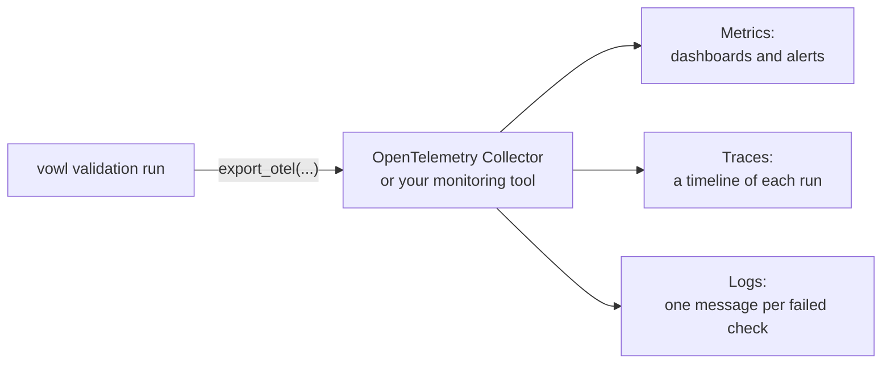

# Exporting to OpenTelemetry

`ValidationResult.export_otel(...)` sends the results of a validation run to the
same monitoring tools you use for everything else, such as Grafana, Datadog,
Honeycomb, or New Relic. It uses OpenTelemetry (OTel), the open standard most of
these tools accept.

OTel has three kinds of data, called **signals**. vowl sends all three by default:

- **Metrics** are the [DQ metrics](index.md), such as "how many rows failed".
  Use them for dashboards and alerts.
- **Traces** are a timeline of one run, with one bar per check. Use them to see
  what ran, how long it took, and what failed.
- **Logs** are one message per failed or broken check. Use them to route
  failures to the people who fix them.



`export_otel` only reads the finished result. It never changes how the checks
ran. It returns the run's ID (`vowl.run.id`, the same as `result.run_id`) so you
can find this run again in your monitoring tool.

## Installation

OpenTelemetry support is optional. Install it with the `[otel]` extra:

```bash
pip install 'vowl[otel]'
```

If the extra is not installed, `export_otel(...)` raises an `ImportError` that
tells you the command above. Plain `import vowl` never loads OpenTelemetry.

## Quick start

```python
from vowl import validate_data

result = validate_data("contract.yaml", df=df)

run_id = result.export_otel(
    endpoint="http://localhost:4317",
    service_name="orders-dq",
    custom_attributes={"deployment.environment": "prod"},
)
```

`endpoint` is the address of your OpenTelemetry Collector or monitoring tool.
In a deployed pipeline you usually leave it out and set the standard
environment variables instead (see [Environment variables](#environment-variables)).

### Try it locally

To see the data arrive before you connect a real monitoring tool, the repo
ships a local OpenTelemetry Collector with Prometheus, Tempo, Loki and a
Grafana DQ dashboard. With Docker running, from the repo root:

```bash
cd examples/6_dq_metrics/otel_stack
make otel-up
make otel-add-vowl-runs
```

Then open <http://localhost:3000/d/vowl-dq>. See
[`examples/6_dq_metrics/otel_stack/`](https://github.com/govtech-data-practice/vowl/tree/main/examples/6_dq_metrics/otel_stack)
for details.

## Where the data goes

vowl needs somewhere to send each signal. It picks the first of these that
applies, separately for metrics, traces, and logs:

1. **You pass your own provider** with `metric_provider`, `tracer_provider`, or
   `logger_provider`. A provider is the OTel object that knows where data goes.
   vowl records into it and leaves it running afterwards. Use this when you
   want full control.
2. **Your application already has OTel set up** and you pass
   `use_global_providers=True`. vowl records into that existing setup. Use this
   inside Airflow, Dagster, or any service that already sends telemetry.
3. **Neither** (the default). vowl connects to `endpoint`, or to the address in
   the environment variables, and sends everything itself. This is the simplest
   option for scripts, notebooks, and batch jobs.

In option 3, `export_otel` waits until sending has finished before it returns,
so a short job does not exit before its data is sent. If the backend rejects
the data or cannot be reached, vowl raises a `RuntimeWarning` that names the
signals that did not arrive. If a signal has no address at all, vowl raises a
`ValueError` before sending anything.

### gRPC or HTTP

OTLP, the OTel wire format, can travel over gRPC or HTTP. Collectors usually
listen on port **4317** for gRPC and port **4318** for HTTP.

```python
result.export_otel(endpoint="http://localhost:4318", protocol="http/protobuf")
```

Over HTTP each signal has its own path: `/v1/metrics`, `/v1/traces`, and
`/v1/logs`. Give vowl the base address (`http://localhost:4318`) and it adds
the right path for each signal. If your address already ends with the path,
vowl leaves it as it is.

### Environment variables

vowl reads the standard OpenTelemetry environment variables when you leave
the matching argument out:

| Variable                                                                                                        | Used for                                                        |
| --------------------------------------------------------------------------------------------------------------- | --------------------------------------------------------------- |
| `OTEL_EXPORTER_OTLP_ENDPOINT`                                                                                   | The address for all three signals                               |
| `OTEL_EXPORTER_OTLP_METRICS_ENDPOINT`, `OTEL_EXPORTER_OTLP_TRACES_ENDPOINT`, `OTEL_EXPORTER_OTLP_LOGS_ENDPOINT` | A separate address for one signal                               |
| `OTEL_EXPORTER_OTLP_PROTOCOL`                                                                                   | `grpc` or `http/protobuf`, when `protocol` is not passed        |
| `OTEL_EXPORTER_OTLP_HEADERS`                                                                                    | Extra headers, such as an API key, when `headers` is not passed |

## Parameters

| Parameter                                                 | Default                         | Purpose                                                                                                                                                                                                                                                                             |
| --------------------------------------------------------- | ------------------------------- | ----------------------------------------------------------------------------------------------------------------------------------------------------------------------------------------------------------------------------------------------------------------------------------- |
| `signals`                                                 | `("metrics", "traces", "logs")` | Which signals to send. Any mix of `"metrics"`, `"traces"`, and `"logs"`.                                                                                                                                                                                                            |
| `endpoint`                                                | `None`                          | Address of your collector or monitoring tool. When left out, the [environment variables](#environment-variables) are used.                                                                                                                                                          |
| `protocol`                                                | `None`                          | `"grpc"` or `"http/protobuf"`. When left out, vowl uses `OTEL_EXPORTER_OTLP_PROTOCOL`, and falls back to `"grpc"`.                                                                                                                                                                  |
| `service_name`                                            | `"vowl"`                        | Names _where_ the validation runs, for example `"orders-dq"`, `"nightly-etl"`, or `"ci-validation"`. Sent as the OTel `service.name` attribute. See [What identifies a validation run](#what-identifies-a-validation-run).                                                          |
| `prefix`                                                  | `"vowl"`                        | The start of every metric name, span name, and vowl attribute name. For example, `"myorg"` turns `vowl.check.check.count` into `myorg.check.check.count` and `vowl.contract.id` into `myorg.contract.id`.                                                                           |
| `headers`                                                 | `None`                          | Extra headers to send, for example an API key.                                                                                                                                                                                                                                      |
| `custom_attributes`                                       | `None`                          | Your own attributes, added to every metric, span, and log record. See [Custom attributes](#custom-attributes).                                                                                                                                                                      |
| `run_id`                                                  | `None`                          | An ID for this export only. When left out, vowl uses `result.run_id`, the ID the run got when it ran and the one in `dq_metrics.json`. Either way, `export_otel` returns it. To change the ID for every output, set `result.run_id` instead. See [The run ID](index.md#the-run-id). |
| `max_failed_rows_sample`                                  | `0`                             | How many failing rows per check to copy into traces and logs. `0` sends no row data. See [Capturing failed rows](#capturing-failed-rows).                                                                                                                                           |
| `use_global_providers`                                    | `False`                         | Record into your application's existing OTel setup instead of connecting directly.                                                                                                                                                                                                  |
| `metric_provider` / `tracer_provider` / `logger_provider` | `None`                          | Your own providers, for full control. They win over every other option for their signal.                                                                                                                                                                                            |

## Run identity attributes

Every piece of data vowl sends carries **attributes**: named labels such as
`schema_name="orders"`. You filter and group by them in your monitoring tool.

### What identifies a validation run

A few attributes answer three questions about every run:

| Question                     | Attribute                                                                    | Source                                  |
| ---------------------------- | ---------------------------------------------------------------------------- | --------------------------------------- |
| **What** is being validated? | `vowl.contract.id`, `vowl.contract.name`, `vowl.data_product`, `vowl.domain` | Taken from the contract                 |
| **Where** is it running?     | `service.name`                                                               | The `service_name` parameter            |
| **Which run** is this?       | `vowl.run.id`                                                                | `result.run_id`, made when the run runs |

The contract already says which data product, domain, and tenant the data
belongs to, so vowl adds those for you. Use `custom_attributes` for anything
else your team needs, such as the environment, the team, or where you saved
the run's output.

### All run identity attributes

vowl adds these contract fields when the contract has a value for them. It does
not copy any other contract fields. To send more, use `custom_attributes`.

| Key                         | Source                                                 | Notes                                        |
| --------------------------- | ------------------------------------------------------ | -------------------------------------------- |
| `service.name`              | `service_name`, default `vowl`                         |                                              |
| `vowl.version`              | vowl package version                                   |                                              |
| `vowl.run.id`               | `result.run_id`, or the `run_id` parameter             | On traces and logs only. See the note below. |
| `vowl.contract.id`          | ODCS `id`                                              |                                              |
| `vowl.contract.name`        | ODCS `name`                                            | Left out when missing                        |
| `vowl.contract.version`     | The contract author's `version`                        | Left out when missing                        |
| `vowl.contract.api_version` | ODCS spec version (`apiVersion`, for example `v3.1.0`) | Not the same as `version`                    |
| `vowl.contract.status`      | ODCS `status`                                          | Left out when missing                        |
| `vowl.contract.created_ts`  | ODCS `contractCreatedTs`                               | Left out when missing                        |
| `vowl.domain`               | ODCS `domain`                                          | ODCS v3 only. Left out when missing.         |
| `vowl.data_product`         | ODCS `dataProduct`                                     | ODCS v3 only. Left out when missing.         |
| `vowl.tenant`               | ODCS `tenant`                                          | Left out when missing                        |

These go on every metric, span, and log record, with one exception.
`vowl.run.id` is not put on metrics. Monitoring tools store one series of
numbers for each unique set of attributes, so a new ID every run would create
new series every run and keep growing your storage and bill. Traces and logs
are looked up one run at a time, so they keep it.

### Custom attributes

Use `custom_attributes` to add your own keys to every signal. This is also how
you send contract fields that vowl does not add itself, such as `tags`.

A common use is to save the run's full output and point to it from your
monitoring tool. Every run already has an ID in `result.run_id`, which the
saved files and the telemetry share, so use it in the folder name:

```python
output_dir = f"s3://my-bucket/dq-results/{result.run_id}/"
tags = result.contract_data.get("tags") or []

result.save(output_dir)
result.export_otel(
    custom_attributes={
        "vowl.artifact.uri": output_dir,
        "vowl.contract.tags": ", ".join(tags),
    },
)
```

Suggested keys. These are naming ideas only, and vowl treats them like any
other key:

- `vowl.artifact.uri`: where `result.save(...)` wrote this run's output.
- `vowl.contract.tags`: the contract's tags.
- `vowl.link.<name>`: any other link for the run, for example `vowl.link.runbook` or `vowl.link.ticket`.

Custom attributes go on metrics too. A value that changes every run, like
`vowl.artifact.uri` above, has the same storage cost as a run ID on metrics.
If that matters for your backend, drop the key from metrics in your OTel
Collector.

## Metrics

The metrics are the [DQ metrics](index.md): readings at check, dimension,
schema and run level, such as `vowl.run.check.count` and
`vowl.schema.row.pass_rate`. That page lists every metric, its attributes,
and which numbers add up. `dq_metrics.json` holds the same readings, so a
dashboard and the saved file always agree. This section covers what is
specific to OpenTelemetry.

All the run identity attributes above are on every metric too, apart from
`vowl.run.id`.

### Metric types

vowl uses the three OpenTelemetry metric types:

| Type          | Metrics                                          | In your monitoring tool                                    |
| ------------- | ------------------------------------------------ | ---------------------------------------------------------- |
| **Counter**   | Every `check.count`, and `vowl.run.schema.count` | Add up over time: "checks that failed this week"           |
| **Gauge**     | Every `row.count` and `pass_rate`                | Show the latest reading, or how it changes from run to run |
| **Histogram** | `vowl.check.duration`, `vowl.run.duration`       | Show the average, or the slowest runs                      |

Counters are for numbers that add up, gauges for numbers that do not. See
[Which numbers add up](index.md#which-numbers-add-up).

### Check counts for the latest run

A counter adds up. To show the failed checks of the latest run, rather than a
running total, ask for the increase over a window that holds one run. In
Prometheus, for a daily run:

```promql
sum by (schema_name) (increase(vowl_schema_check_count_total{status="FAILED"}[1d]))
```

Backends that store counters as changes per export, such as Datadog or
Honeycomb, show each run's counts directly. For a simple "latest run" tile,
the `check.pass_rate` gauges are often all you need.

vowl sends every status on every run, zeros included, so a status series
exists from the first run and `increase` never has to guess.

### Runs close together

Gauges keep only the last reading taken before the data is sent. In the
default setup, vowl sends each run's data as soon as the run ends, so every
run is kept.

When you record into your own provider or your application's existing one
(options 1 and 2 in [Where the data goes](#where-the-data-goes)), data is
usually sent on a timer instead. If the same contract runs twice before the
timer fires, only the second run's row counts and pass rates are sent. The
check counts and the timings still count both runs, because they are not
gauges. Runs that are minutes or hours apart are not affected.

## Traces

A trace is a timeline of one run. It is made of **spans**: one span for the
whole run, with one span inside it for each check. A run started from an
orchestrator that already sends traces (Airflow, Dagster, and others) appears
inside that orchestrator's trace.

A span's status says whether the work itself broke, not whether the data was
good. A check that finds bad data (status `FAILED`) worked as intended, so its
span is `OK`. Only a check that could not run (status `ERROR`) gets an `ERROR`
span. This matches the logs, where a failed check is a warning and a broken
check is an error, so alerts on span error rates do not fire for ordinary data
problems. To find failed checks in a trace, filter on the `status` attribute
(`status = "FAILED"`).

### Run span: `vowl.validate`

One per run. It starts when vowl connects to the data and ends when the last
check finishes. Its status is `ERROR` if any check could not run, and `OK`
otherwise. The `check.count.failed` attribute counts the checks that found bad
data.

Its attributes are the run-level [DQ metrics](index.md), with the same
values. They are named without the level because the span is the run. A span
holds one value per name, so the status is part of the name:
`vowl.run.check.count{status="FAILED"}` becomes `check.count.failed`.

| Attribute                | Same as                                  | Description                                                                      | Presence                    |
| ------------------------ | ---------------------------------------- | -------------------------------------------------------------------------------- | --------------------------- |
| `check.count.passed`     | `vowl.run.check.count{status="PASSED"}`  | Number of checks that passed                                                     | Always                      |
| `check.count.failed`     | `vowl.run.check.count{status="FAILED"}`  | Number of checks that found bad data                                             | Always                      |
| `check.count.error`      | `vowl.run.check.count{status="ERROR"}`   | Number of checks that could not run                                              | Always                      |
| `check.pass_rate`        | `vowl.run.check.pass_rate`               | Share of checks that passed, 0 to 1. Checks that could not run count against it. | When the run has checks     |
| `schema.count.passed`    | `vowl.run.schema.count{status="PASSED"}` | Number of schemas whose checks all passed                                        | Always                      |
| `schema.count.failed`    | `vowl.run.schema.count{status="FAILED"}` | Number of schemas with a check that found bad data                               | Always                      |
| `schema.count.error`     | `vowl.run.schema.count{status="ERROR"}`  | Number of schemas with a check that could not run, and none that failed          | Always                      |
| `row.count.passed`       | `vowl.run.row.count{status="PASSED"}`    | Rows that passed every counted check, over all schemas                           | When the run has row counts |
| `row.count.failed`       | `vowl.run.row.count{status="FAILED"}`    | Rows that failed at least one counted check, over all schemas                    | When the run has row counts |
| `row.pass_rate`          | `vowl.run.row.pass_rate`                 | Share of rows that passed, 0 to 1                                                | When the run has rows       |
| `vowl.row_quality.exact` | `vowl.row_quality.exact`                 | Whether the row numbers are exact                                                | When the run has row counts |

### Check span: `vowl.check`

One per check. Its status is `ERROR` for a check that could not run, and `OK`
otherwise, including for a check that failed. Its `check_name`, `status`,
`schema_name`, `dimension`, `severity` and `engine` are the same as on the
check-level metrics, so you can go from a metric to its span by filtering on
them. For an `ERROR` status, the
check's message (such as the database error) is the status description.

The row attributes are on the same checks as the check-level row metrics. A
check that returns one number instead of rows (such as an average), or that
could not run, has none. A `0` there would wrongly say every row passed. See
[Which Checks Contribute Failed Rows](../design-considerations/failed-rows/which-checks.md).

Each check span lasts as long as the check did. vowl does not record the exact
moment each check started, so the spans are placed one after another from the
start of the run. When checks ran at the same time, they all start at the
start of the run instead. Durations are exact. The start positions are only
approximate.

| Attribute                        | Description                                                                                                                                | Presence                                     |
| -------------------------------- | ------------------------------------------------------------------------------------------------------------------------------------------ | -------------------------------------------- |
| `check_name`                     | Name of the check                                                                                                                          | Always                                       |
| `status`                         | `PASSED`, `FAILED`, or `ERROR`                                                                                                             | Always                                       |
| `schema_name`                    | Schema the check belongs to                                                                                                                | When known                                   |
| `dimension`                      | Quality dimension (for example `completeness` or `consistency`)                                                                            | Always. `"unknown"` when the check has none. |
| `severity`                       | Check severity (for example `error` or `warning`)                                                                                          | When the contract sets one                   |
| `engine`                         | How the check ran: `sql` for SQL checks, or the engine a custom check names                                                                | When known                                   |
| `operator`                       | How the result was compared (for example `mustBe`)                                                                                         | When known                                   |
| `query`                          | The SQL the check ran                                                                                                                      | When known                                   |
| `expected_value`                 | The expected value or threshold                                                                                                            | When known                                   |
| `actual_value`                   | The value vowl found                                                                                                                       | When known                                   |
| `row.count.passed`               | Rows that passed this check. Same as `vowl.check.row.count{status="PASSED"}`.                                                              | When the check gets row counts               |
| `row.count.failed`               | Rows that failed this check. Same as `vowl.check.row.count{status="FAILED"}`.                                                              | When the check gets row counts               |
| `row.pass_rate`                  | Share of rows that passed this check, 0 to 1. Same as `vowl.check.row.pass_rate`.                                                          | When the check gets row counts               |
| `check.definition.*`             | The check's full definition, one key per field. For a check vowl generated (such as `required`), this is the definition vowl wrote for it. | When known                                   |
| `check.definition.custom.<name>` | The check's `customProperties`, one key per property                                                                                       | When the contract sets them                  |

### Failed row events: `vowl.failed_row`

When `max_failed_rows_sample` is above 0, each failing check span also holds
up to that many `vowl.failed_row` events. An event is a point on the span's
timeline with its own attributes. Here, its attributes are the column names and
values of one failing row.

### Worked example

A run checks one schema, `orders`, with 1,000 rows and five checks. Two pass,
two fail, and one cannot run because its query names a column that does not
exist. 43 rows fail at least one check: 42 have no email, 3 have a duplicate
`order_id`, and 2 rows have both.

```
Trace 7f3a...  (inside the pipeline's trace, if there is one)
|
+- SPAN  vowl.validate                              status=ERROR   1840ms
   |   vowl.run.id               = 0f2c9e1a-...
   |   vowl.contract.id          = customer_orders
   |   vowl.contract.version     = 3.0.0
   |   vowl.contract.api_version = v3.1.0
   |   vowl.domain               = sales
   |   vowl.tenant               = agency-a
   |   check.count.passed=2  check.count.failed=2  check.count.error=1
   |   check.pass_rate=0.4
   |   schema.count.passed=0  schema.count.failed=1  schema.count.error=0
   |   row.count.passed=957  row.count.failed=43  row.pass_rate=0.957
   |   vowl.row_quality.exact=true
   |
   +- SPAN vowl.check  email_required_check          status=OK       38ms
   |     schema_name=orders  dimension=completeness  severity=error
   |     status=FAILED  engine=sql
   |     row.count.passed=958  row.count.failed=42  row.pass_rate=0.958
   |
   +- SPAN vowl.check  updated_at_within_24h         status=OK       51ms
   |     dimension=timeliness  status=PASSED  operator=mustBe
   |     row.count.passed=1000  row.count.failed=0  row.pass_rate=1.0
   |     query='SELECT COUNT(*) FROM "orders" WHERE updated_at < NOW() - INTERVAL 24 HOUR'
   |     expected_value=0  actual_value=0
   |     check.definition.custom.owner=risk-team
   |
   +- SPAN vowl.check  order_id_required_check       status=OK       12ms
   |     dimension=completeness  status=PASSED
   |     row.count.passed=1000  row.count.failed=0  row.pass_rate=1.0
   |
   +- SPAN vowl.check  order_id_unique_check         status=OK       44ms
   |     dimension=consistency  status=FAILED
   |     row.count.passed=997  row.count.failed=3  row.pass_rate=0.997
   |
   +- SPAN vowl.check  region_valid                  status=ERROR     9ms
         "Error executing check: Binder Error: Referenced column "region" not found"
         dimension=conformity  status=ERROR
```

The two failed checks have `OK` spans and `status=FAILED`. The run span is
`ERROR` only because `region_valid` could not run. The quoted line under that
span is its status description. It has no row attributes, because a check that
could not run has no row counts.

## Logs

vowl writes one log record for each check that failed or could not run.
Checks that pass write nothing.

- A check that **failed** (status `FAILED`) logs at `WARN`. The data has a
  problem, which is normal day-to-day work.
- A check that **could not run** (status `ERROR`) logs at `ERROR`. Something in
  the check itself is broken, such as a query naming a missing column.

This keeps `ERROR` logs for "vowl itself needs fixing", so ordinary data
problems do not page anyone like an outage. To alert on every failure, filter
on the `status` attribute instead.

| Field                            | Description                                                                                                                |
| -------------------------------- | -------------------------------------------------------------------------------------------------------------------------- |
| **Severity**                     | `WARN` for a failed check, `ERROR` for a check that could not run                                                          |
| **Body**                         | The check's message. A check with no message gets `vowl.check failed: <check_name>` or `vowl.check errored: <check_name>`. |
| **`trace_id`** and **`span_id`** | The check's span, when traces are sent in the same call. Your monitoring tool uses them to jump from the log to the trace. |

### Log record attributes

| Attribute                        | Description                                                                                                                                | Presence                                                 |
| -------------------------------- | ------------------------------------------------------------------------------------------------------------------------------------------ | -------------------------------------------------------- |
| `check_name`                     | Name of the check                                                                                                                          | Always                                                   |
| `status`                         | `FAILED` or `ERROR`                                                                                                                        | Always                                                   |
| `schema_name`                    | Schema the check belongs to                                                                                                                | When known                                               |
| `dimension`                      | Quality dimension                                                                                                                          | Always. `"unknown"` when the check has none.             |
| `severity`                       | Check severity                                                                                                                             | When the contract sets one                               |
| `engine`                         | How the check ran: `sql` for SQL checks, or the engine a custom check names                                                                | When known                                               |
| `row.count.passed`               | Rows that passed this check, as on its span                                                                                                | When the check gets row counts                           |
| `row.count.failed`               | Rows that failed this check, as on its span                                                                                                | When the check gets row counts                           |
| `row.pass_rate`                  | Share of rows that passed this check, as on its span                                                                                       | When the check gets row counts                           |
| `query`                          | The SQL the check ran                                                                                                                      | When known                                               |
| `check.definition.*`             | The check's full definition, one key per field. For a check vowl generated (such as `required`), this is the definition vowl wrote for it. | When known                                               |
| `check.definition.custom.<name>` | The check's `customProperties`, one key per property                                                                                       | When the contract sets them                              |
| `vowl.failed_rows_sample`        | Sampled failing rows, as a JSON list                                                                                                       | When `max_failed_rows_sample` is above 0 and rows failed |

### Worked example

The run from the traces example writes three log records. The two checks that
passed write nothing. The first line of each record is its body.

```
[WARN]  Column 'email' must not contain NULL values
        trace_id=7f3a...  span_id=a11c...
        check_name=email_required_check  status=FAILED
        schema_name=orders  dimension=completeness
        row.count.passed=958  row.count.failed=42  row.pass_rate=0.958

[WARN]  Column 'order_id' must contain unique values
        trace_id=7f3a...  span_id=b02d...
        check_name=order_id_unique_check  status=FAILED
        schema_name=orders  dimension=consistency
        row.count.passed=997  row.count.failed=3  row.pass_rate=0.997

[ERROR] Error executing check: Binder Error: Referenced column "region" not found
        trace_id=7f3a...  span_id=c73e...
        check_name=region_valid  status=ERROR
        schema_name=orders  dimension=conformity
        query='SELECT COUNT(*) FROM "orders" WHERE region NOT IN (...)'
```

## Capturing failed rows

By default `export_otel` sends **counts only**. No values from your data leave
the process. There are three ways to get from an alert to the rows behind it:

1. **`row.count.failed`** is on each counted check's span and log record. It
   holds a count and no data values.
2. **A small sample** with `max_failed_rows_sample`. Set it above 0 and each
   failing check copies up to that many rows into its span (as
   `vowl.failed_row` events) and its log record (as `vowl.failed_rows_sample`).
   The run's own `max_failed_rows` setting also caps it, whichever is smaller.
3. **A link to the saved output**, with `custom_attributes`. See
   [Custom attributes](#custom-attributes).

!!! warning "Sampled rows contain real data"

    A positive `max_failed_rows_sample` copies real failing rows into your
    telemetry. Only turn it on when your monitoring tool is an acceptable place
    for that data, and take care with personal data.
