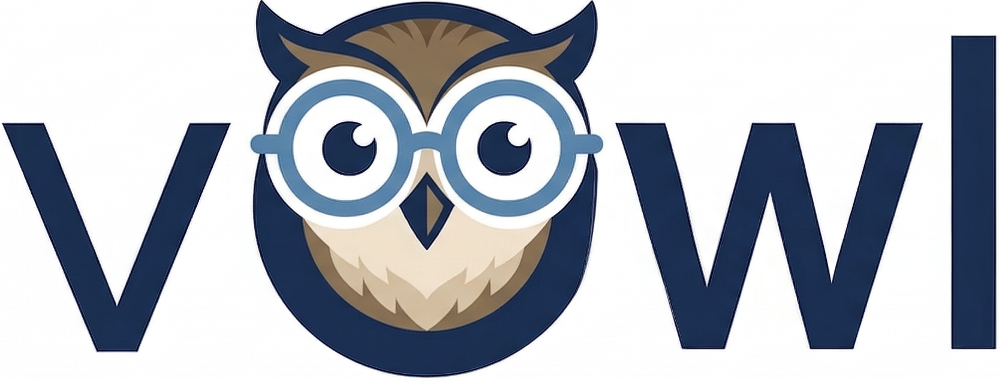

---
hide:
  - navigation
description: >-
  vowl is a validation engine for Open Data Contract Standard (ODCS) data contracts.
  Define rules in declarative YAML and validate pandas, Polars, PySpark DataFrames
  and 20+ Ibis backends with rich, actionable reports.
---

  

# vowl

vowl (vee-owl 🦉): a validation engine for [Open Data Contract Standard (ODCS)](https://github.com/bitol-io/open-data-contract-standard) data contracts. Define your validation rules once in a declarative YAML contract and get rich, actionable reports on your data's quality.

## Key Features

- **Extensible Check Engine:** Ships with a SQL check engine out of the box, with the architecture designed to support custom check types beyond SQL.
- **Generated Checks:** Checks are built for you from contract metadata (`logicalType`, `logicalTypeOptions`, `required`, `unique`, `primaryKey`), and from library checks you declare with `type: library` (`nullValues`, `missingValues`, `invalidValues`, `duplicateValues`, `rowCount`).
- **Any DataFrame, Any Backend:** Load any [Narwhals-compatible](https://github.com/narwhals-dev/narwhals) DataFrame type (pandas, Polars, PySpark, etc.) or connect to **20+ backends** via [Ibis](https://github.com/ibis-project/ibis). SQL dialect translation is handled by [SQLGlot](https://github.com/tobymao/sqlglot).
- **Runs in Your Database:** SQL checks run inside your database through Ibis. Only counts and failed rows come back. A table is downloaded to count checks that are not plain row filters when you ask for DQ metrics, and in full for the annotated output, which `save()` writes by default.
- **Multi-Source Validation:** One contract can cover tables in different databases, with checks that compare them.
- **Declarative ODCS Contracts:** Define validation rules in YAML following the [Open Data Contract Standard](https://github.com/bitol-io/open-data-contract-standard).
- **Flexible Filtering:** Filter conditions with wildcard pattern matching, ideal for incremental validation of new data.
- **Clear Results:** Summaries, your tables with the rows that failed annotated, row pass rates, files you can save, and [DQ metrics](dq-metrics/understanding-metrics.md) for dashboards.
- **No Silent Gaps:** Unimplemented or unrecognised checks surface as `ERROR`, not quietly skipped, so nothing slips through the cracks.

## Next Steps

- [Get Started](getting-started.md) installs vowl and walks through a first run.

## License

This project is licensed under the [MIT License](https://github.com/govtech-data-practice/vowl/blob/main/LICENSE).
