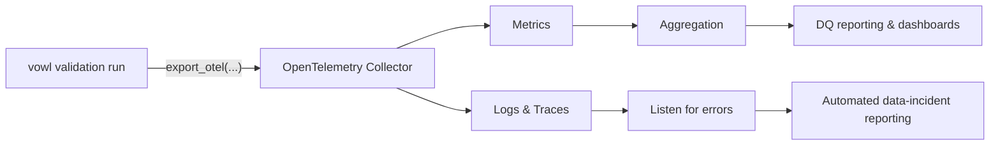

# OpenTelemetry Export

`ValidationResult.export_otel(...)` turns a finished validation run into
OpenTelemetry signals so your data-quality results land in the same observability
stack as the rest of your platform. The call reads the finished result only and
returns the generated `vowl.run.id` so you can link the telemetry back to the run.



`signals` selects any subset of `"metrics"`, `"traces"`, and `"logs"`. All three
are enabled by default.

## Installation

OpenTelemetry is an optional dependency behind the `[otel]` extra:

```bash
pip install 'vowl[otel]'
```

The OTEL packages are loaded lazily on the first `export_otel(...)` call. If the
extra is missing, `export_otel(...)` raises an `ImportError` with install
instructions.

## Quick start

```python
from vowl import validate_data

result = validate_data("contract.yaml", df=df)

run_id = result.export_otel(
    endpoint="http://localhost:4317",   # or leave unset to honour OTEL_EXPORTER_OTLP_* env vars
    signals=("metrics", "traces", "logs"),
    protocol="grpc",                    # or "http/protobuf"
    service_name="orders-dq",
    custom_attributes={"deployment.environment": "prod"},
)
```

Leave `endpoint` unset to fall back to the standard `OTEL_EXPORTER_OTLP_*`
environment variables, which is the usual choice in a deployed pipeline.

## Parameters

| Parameter | Default | Purpose |
| --------- | ------- | ------- |
| `signals` | `("metrics", "traces", "logs")` | Any subset of `"metrics"`, `"traces"`, `"logs"`. All three are on by default. |
| `endpoint` | `None` | OTLP endpoint. When omitted, `OTEL_EXPORTER_OTLP_*` env vars are used. |
| `protocol` | `"grpc"` | Transport protocol: `"grpc"` or `"http/protobuf"`. |
| `service_name` | `"vowl"` | Identifies *where* the validation is running (e.g. `"orders-dq"`, `"nightly-etl"`, `"ci-validation"`). Maps to the OTel `service.name` attribute. See [What identifies a validation run](#what-identifies-a-validation-run). |
| `prefix` | `"vowl"` | Prefix for all metric names, span names, and attribute keys. For example, setting `"myorg"` changes `vowl.check.count` to `myorg.check.count`, `vowl.contract.id` to `myorg.contract.id`, etc. |
| `headers` | `None` | Optional OTLP headers, for example auth tokens. |
| `custom_attributes` | `None` | Additional attributes merged onto every data point, span, and log record. See [Custom attributes](#custom-attributes). |
| `max_failed_rows_sample` | `0` | Max failing rows attached per check to logs and span events. `0` exports no cell values. |
| `use_global_providers` | `False` | Record into the process's already-configured global providers instead of building OTLP exporters. |
| `metric_provider` / `tracer_provider` / `logger_provider` | `None` | Explicit providers for full control. Take precedence over everything else. |

## Run identity attributes

### What identifies a validation run

Every signal carries attributes that answer three questions:

| Question | Attribute | Source |
| --- | --- | --- |
| **What** is being validated? | `vowl.contract.id`, `vowl.contract.name`, `vowl.data_product`, `vowl.domain` | Pulled from the contract automatically |
| **Who** is running the validation? | `service.name` | Set via `service_name` parameter |
| **Which run** is this? | `vowl.run.id` | Generated per run (UUID) |

The contract already describes the data product, domain, and tenant, so vowl
includes these automatically. `service_name` identifies where the validation is
running, whether that is a scheduled pipeline, a notebook, a CI job, or a
one-off script. Use `custom_attributes` for anything else your team needs
(environment, team, saved output location).

### All run identity attributes

These attributes are attached to every metric data point, span, and log record.
They include all first-level scalar fields from the contract. Fields beyond the
first level (nested objects, arrays) are excluded because they can have
unbounded cardinality. To include any of these, pass them via
`custom_attributes`.

| Key | Source | Notes |
| --- | --- | --- |
| `service.name` | config, default `vowl` | |
| `vowl.version` | package version | |
| `vowl.run.id` | generated per run (UUID) | de-duplicates retried runs |
| `vowl.contract.id` | ODCS `id` | |
| `vowl.contract.name` | ODCS `name` | omitted when absent |
| `vowl.contract.version` | contract author's `version` | omitted when absent |
| `vowl.contract.api_version` | ODCS spec version (`apiVersion`, e.g. `v3.2.0`) | distinct field from `version` |
| `vowl.contract.status` | ODCS `status` | omitted when absent |
| `vowl.contract.created_ts` | ODCS `contractCreatedTs` | omitted when absent |
| `vowl.domain` | ODCS `domain` | v3 only, omitted when absent |
| `vowl.data_product` | ODCS `dataProduct` | v3 only, omitted when absent |
| `vowl.tenant` | ODCS `tenant` | omitted when absent |

### Custom attributes

Use `custom_attributes` to attach your own keys to every signal. This is
also how you include contract fields beyond the first level (tags, nested
objects) that vowl does not include by default.

```python
tags = result.contract_data.get("tags", [])

result.save("s3://dq/run=0f2c9e1a/")
result.export_otel(
    custom_attributes={
        "vowl.artifact.uri": "s3://dq/run=0f2c9e1a/",
        "vowl.contract.tags": ", ".join(tags),
    },
)
```

Example keys:

- `vowl.artifact.uri` -- where `result.save(...)` persisted the output for this run
- `vowl.contract.tags` -- contract tags from the ODCS contract
- `vowl.link.<name>` -- any other link on the run (e.g. `vowl.link.runbook`, `vowl.link.ticket`)


## Metrics

Each metric is a named counter or gauge. Every data point carries a set of
**tags** (OTel calls them "attributes") that describe what it measured. You
filter and group by these tags downstream to build dashboards.

There are two kinds of metric:

- **Counters** give you raw numbers (row counts, check counts, durations).
  Each run reports its own values.
- **Gauges** give you pre-computed rates (0 to 1) for a single run.

### Per check

One data point per check in the run.

| Metric | Type | What it measures | Tags |
| --- | --- | --- | --- |
| `vowl.check.count` | Counter | 1 per check | `status`, `schema_name`, `dimension`, `severity`, `check_name` |
| `vowl.check.failed_rows` | Counter | Failed row count per check | `schema_name`, `dimension`, `check_name` |
| `vowl.check.row_pass_rate` | Gauge | Clean rows / total rows for this check (0 to 1) | `schema_name`, `dimension`, `check_name` |
| `vowl.check.duration` | Histogram | Execution time (ms) per check | `schema_name`, `engine`, `check_name` |

### Per dimension

One data point per `(schema_name, dimension)` pair.

| Metric | Type | What it measures | Tags |
| --- | --- | --- | --- |
| `vowl.dimension.failed_rows` | Counter | Unique failing rows in this dimension | `schema_name`, `dimension` |
| `vowl.dimension.check_pass_rate` | Gauge | Checks passed / total checks (0 to 1) | `schema_name`, `dimension` |
| `vowl.dimension.row_pass_rate` | Gauge | Clean rows / total rows (0 to 1) | `schema_name`, `dimension` |

### Per schema

One data point per schema.

| Metric | Type | What it measures | Tags |
| --- | --- | --- | --- |
| `vowl.schema.failed_rows` | Counter | Unique failing rows across all dimensions | `schema_name` |
| `vowl.schema.rows_total` | Counter | Total rows examined | `schema_name` |
| `vowl.schema.check_pass_rate` | Gauge | Checks passed / total checks (0 to 1) | `schema_name` |
| `vowl.schema.row_pass_rate` | Gauge | Clean rows / total rows (0 to 1) | `schema_name` |

### Per run

One data point for the entire validation run.

| Metric | Type | What it measures | Tags |
| --- | --- | --- | --- |
| `vowl.run.duration` | Counter | Total run time (ms) | resource only |

### How failed rows are counted

The `failed_rows` metrics exist at three levels, each with a different
deduplication scope:

- **`check.failed_rows`** -- raw count from each check. No deduplication. A
  row that fails two checks is counted once per check.
- **`dimension.failed_rows`** -- deduplicated within each dimension. A row
  that fails two checks in the same dimension counts once for that dimension.
  A row that fails in two different dimensions counts once per dimension.
- **`schema.failed_rows`** -- deduplicated across all checks and dimensions.
  A row is counted once regardless of how many checks or dimensions it fails in.

The worked example below shows the difference in practice.

### Worked example

Schema `orders` has 100 rows and 3 checks. Two fail: `not_null_email`
(completeness, 5 rows) and `unique_order_id` (consistency, 3 rows). One row
has both a null email and a duplicate order_id.

```
-- Per check (raw count per check, no deduplication)
vowl.check.count:         1   {status="FAILED", dimension="completeness", check_name="not_null_email"}
vowl.check.count:         1   {status="FAILED", dimension="consistency",  check_name="unique_order_id"}
vowl.check.count:         1   {status="PASSED", dimension="completeness", check_name="not_null_order_id"}
vowl.check.failed_rows:   5   {check_name="not_null_email"}
vowl.check.failed_rows:   3   {check_name="unique_order_id"}
vowl.check.row_pass_rate: 0.95  {check_name="not_null_email"}
vowl.check.row_pass_rate: 0.97  {check_name="unique_order_id"}

-- Per dimension (deduplicated within each dimension)
vowl.dimension.failed_rows:      5     {dimension="completeness"}
vowl.dimension.failed_rows:      3     {dimension="consistency"}
vowl.dimension.check_pass_rate:  0.5   {dimension="completeness"}
vowl.dimension.check_pass_rate:  0.0   {dimension="consistency"}
vowl.dimension.row_pass_rate:    0.95  {dimension="completeness"}
vowl.dimension.row_pass_rate:    0.97  {dimension="consistency"}

-- Per schema (deduplicated across all dimensions)
-- 7 unique rows, not 5 + 3 = 8, because 1 row failed in both dimensions
vowl.schema.failed_rows:      7      {schema_name="orders"}
vowl.schema.rows_total:       100    {schema_name="orders"}
vowl.schema.check_pass_rate:  0.333  {schema_name="orders"}
vowl.schema.row_pass_rate:    0.93   {schema_name="orders"}

-- Per run
vowl.run.duration:  340  {}
```


## Traces

One root span plus one child span per check, laid out as a timed waterfall.
Each check span carries `failed_rows_count`. A run nested inside an instrumented
orchestrator (Airflow, Dagster, etc.) attaches to the parent trace automatically.

### Root span: `vowl.validate`

One per run. Duration is the run wall time. Span status is `OK` when the run
passed, `ERROR` otherwise.

| Attribute | Description | Presence |
| --- | --- | --- |
| `total_checks` | Total number of checks in the run | Always |
| `passed` | Number of passed checks | Always |
| `failed` | Number of failed checks | Always |
| `errors` | Number of errored checks | Always |
| `success_rate` | Pass rate as a percentage (e.g. `80.0`) | Always |

### Child span: `vowl.check`

One per check. Span status is `ERROR` for a FAILED or ERROR check, `OK`
otherwise.

| Attribute | Description | Presence |
| --- | --- | --- |
| `check_name` | Name of the check | Always |
| `status` | `PASSED`, `FAILED`, or `ERROR` | Always |
| `schema_name` | Schema the check belongs to | When available |
| `dimension` | DQ dimension (e.g. `completeness`, `consistency`) | Always (falls back to `"unknown"`) |
| `severity` | Check severity (e.g. `error`, `warning`) | When declared |
| `engine` | Execution engine (e.g. `duckdb`) | When available |
| `operator` | Check operator (e.g. `not_null`, `mustBe`) | When available |
| `query` | The engine-rendered SQL the check ran | When available |
| `expected_value` | The expected value or threshold | When available |
| `actual_value` | The actual value observed | When available |
| `failed_rows_count` | Number of rows that failed this check | Always (defaults to 0) |
| `check.definition.*` | Flattened keys from the authored ODCS check definition | When `check_definition` exists in metadata |
| `check.definition.custom.<name>` | Author-defined `customProperties`, keyed by property name | When `customProperties` are declared |

### Span events: `vowl.failed_row`

When `max_failed_rows_sample > 0`, each failing check span carries up to that
many `vowl.failed_row` events. Each event's attributes are the column
names and values of the failing row.

### Worked example

A run validates one schema `orders` on an ODCS v3 contract with five checks: two
authored `quality` rules (completeness, timeliness), two auto-generated checks
(`required`, `unique`), and one check that fails to run. Two pass, two fail, one
errors.

```
Trace 7f3a...  (joins the active pipeline trace if one exists)
|
+- SPAN  vowl.validate                              status=ERROR   1840ms
   |   vowl.run.id           = 0f2c9e1a-...
   |   vowl.contract.id      = customer_orders
   |   vowl.contract.version = 3.0.0
   |   vowl.contract.api_version = v3.2.0
   |   vowl.domain           = sales
   |   vowl.tenant           = agency-a
   |   total_checks=5  passed=2  failed=2  errors=1  success_rate=40.0
   |
   +- SPAN vowl.check  "orders.email not null"       status=ERROR    38ms
   |     schema_name=orders  dimension=completeness  severity=error
   |     status=FAILED  engine=duckdb  operator=not_null
   |     query='SELECT COUNT(*) FROM "orders" WHERE "email" IS NULL'
   |     failed_rows_count=42
   |     check.definition.custom.owner=risk-team
   |     check.definition.custom.sla.minutes=30
   |
   +- SPAN vowl.check  "orders.updated_at < 24h"      status=OK       51ms
   |     dimension=timeliness  status=PASSED
   |     expected_value="<= 24h"
   |     actual_value=2026-09-23T04:12:00Z
   |
   +- SPAN vowl.check  "orders.order_id required"     status=OK       12ms
   |     dimension=completeness  status=PASSED
   |
   +- SPAN vowl.check  "orders.order_id unique"       status=ERROR    44ms
   |     dimension=consistency  status=FAILED  failed_rows_count=3
   |
   +- SPAN vowl.check  "orders.region in enum"        status=ERROR     9ms
         dimension=conformity  status=ERROR
         details="Binder Error: column region not found"
```

## Logs

One `WARN` record per **FAILED** check and one `ERROR` record per **ERROR** check
(the check machinery itself broke). Passing checks are silent. When traces are
emitted in the same call, each record carries its check span's `trace_id` and
`span_id`.

| Field | Description |
| --- | --- |
| **Severity** | `WARN` for FAILED checks (data issue), `ERROR` for ERROR checks (check machinery broke) |
| **Body** | The check's detail message, or `"vowl.check failed: {check_name}"` |
| **`trace_id`** | Trace ID of the corresponding check span (when traces are emitted) |
| **`span_id`** | Span ID of the corresponding check span (when traces are emitted) |

### Log record attributes

| Attribute | Description | Presence |
| --- | --- | --- |
| `check_name` | Name of the check | Always |
| `status` | `FAILED` or `ERROR` | Always |
| `schema_name` | Schema the check belongs to | When available |
| `dimension` | DQ dimension | Always (falls back to `"unknown"`) |
| `severity` | Check severity | When declared |
| `engine` | Execution engine | When available |
| `failed_rows_count` | Number of rows that failed this check | Always (defaults to 0) |
| `query` | The engine-rendered SQL the check ran | When available |
| `check.definition.*` | Flattened keys from the authored ODCS check definition | When `check_definition` exists in metadata |
| `check.definition.custom.<name>` | Author-defined `customProperties`, keyed by property name | When `customProperties` are declared |
| `vowl.failed_rows_sample` | JSON array of sampled failing rows | When `max_failed_rows_sample > 0` and the check has failing rows |

### Worked example

The same run from the traces example produces three log records. The two PASSED
checks are silent.

```
[WARN]  vowl.check failed: orders.email not null
        trace_id=7f3a...  span_id=a11c...
        schema_name=orders  dimension=completeness  status=FAILED
        check_name=orders.email not null  failed_rows_count=42
        query='SELECT COUNT(*) FROM "orders" WHERE "email" IS NULL'
        check.definition.custom.owner=risk-team
        body="42 rows have null email"

[WARN]  vowl.check failed: orders.order_id unique
        trace_id=7f3a...  span_id=b02d...
        schema_name=orders  dimension=consistency  status=FAILED  failed_rows_count=3
        body="3 duplicate order_id values"

[ERROR] vowl.check errored: orders.region in enum
        trace_id=7f3a...  span_id=c73e...
        schema_name=orders  dimension=conformity  status=ERROR
        body="Binder Error: column region not found"
```

## Advanced

### How `export_otel` connects to your backend

`export_otel` needs an OpenTelemetry provider to send data. There are three
ways to set one up, and vowl picks the first one that applies:

1. **You pass a provider directly** (`metric_provider`, `tracer_provider`, or
   `logger_provider`). Use this when you need full control over the
   connection. vowl records into it and leaves it alone afterwards.

2. **Your application already has OTel configured** and you set
   `use_global_providers=True`. vowl records into the existing setup. Use
   this inside Airflow, Dagster, or any service that already sends telemetry.

3. **Neither of the above** (the default). vowl connects to your `endpoint`
   (or the `OTEL_EXPORTER_OTLP_ENDPOINT` env var), sends everything, and
   makes sure the data is delivered before returning. This is the simplest
   option for scripts and notebooks. If no endpoint is configured, vowl
   raises a clear error rather than failing silently.

All three options emit the same data. Contract identity (`vowl.contract.id`,
`vowl.run.id`, etc.) and any `custom_attributes` you pass are attached
directly to every metric data point, span, and log record, so they are always
available in your backend regardless of which option you use.

### Capturing failed rows

By default, `export_otel` sends **summary information only**. No actual row
data leaves the process. There are three ways to bridge the gap between an alert and the
actual failing data:

1. **`failed_rows_count`** is always present on every check span and every failing
   log record. No cell values are exported.
2. **An inline sample** via `max_failed_rows_sample`. Set a positive value and each
   failing check attaches up to that many rows as `vowl.failed_row` span
   events and a `vowl.failed_rows_sample` attribute on the log record. The
   count is capped by both this flag and the run's own `max_failed_rows` config.
3. **A saved artifact link** via `custom_attributes`. See
   [Custom attributes](#custom-attributes).

!!! warning "Sampled rows contain real cell values"
    A positive `max_failed_rows_sample` copies actual failing rows into your
    telemetry. Only enable it when your telemetry backend is an acceptable home for
    that data, and mind PII.
