# Local OpenTelemetry stack

This folder runs a full OpenTelemetry backend on your machine, sends it vowl
validation runs for a small catalog of four data contracts, and shows the
results in Grafana. Use it to answer two questions:

- **Does `result.export_otel(...)` deliver metrics, traces and logs that a
  monitoring tool can use?**
- **What does data quality look like across a catalog of contracts, when every
  run carries its contract and domain?**

Nothing here is needed to use vowl. It is a test bench for the OTel exporter.

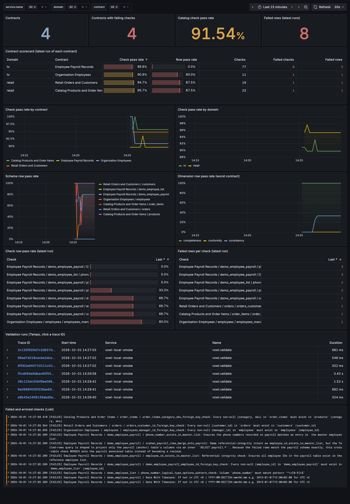

## What happens

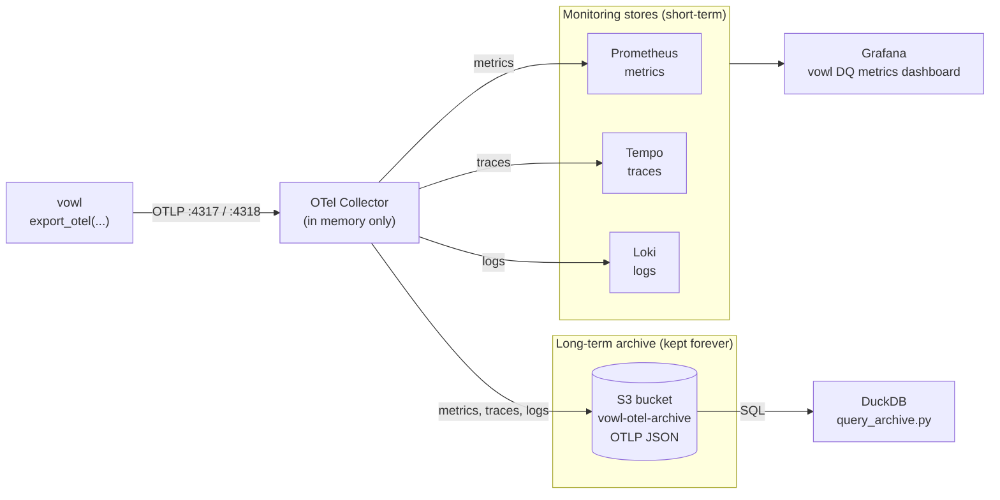

1. `make otel-add-vowl-runs` runs several rounds. Each round validates every
   contract in the catalog against a random sample of its data, and each
   validation calls `export_otel(...)` once. Later rounds sample more rows, so
   the numbers move between rounds.
2. vowl sends one OTLP batch per validation to the collector: metrics (pass
   rates, row and check counts, durations), one trace (a `vowl.validate` span
   with one `vowl.check` span per check) and one log record per failed or
   errored check.
3. Every batch carries the contract's attributes (`vowl.contract.name`,
   `vowl.contract.id`, `vowl.contract.version`, `vowl.domain` and more), taken
   from the contract file. That is what lets the dashboard group and filter the
   catalog.
4. The collector forwards each signal to its own monitoring store, and Grafana
   reads all three. It also writes a copy of every batch to an S3 bucket, the
   long-term archive, which you can query with SQL.

If a panel, a trace or a log is missing, the matching part of the exporter is
not working.

### The catalog

The contracts come from the repo's test data, so nothing extra is downloaded.

| Key       | Contract                                            | Domain | Schemas | Checks |
| --------- | --------------------------------------------------- | ------ | ------- | ------ |
| `payroll` | `tests/employee/employee_payroll_datacontract.yaml` | hr     | 2       | 77     |
| `org`     | `tests/relationships/org_datacontract.yaml`         | hr     | 1       | 11     |
| `retail`  | `tests/relationships/retail_datacontract.yaml`      | retail | 2       | 19     |
| `catalog` | `tests/relationships/catalog_datacontract.yaml`     | retail | 2       | 23     |

Each contract gets its own in-memory DuckDB connection, the same way separate
pipelines would each run their own validation. Use `--contracts` to send only
some of them.

## What you need

- Docker, with Docker Compose
- The `[otel]` extra: `uv sync --extra otel` (or `make install-all` at the repo
  root)

## Quick start

This folder has its own Makefile. From this folder:

```bash
make otel-up
```

```bash
make otel-add-vowl-runs
```

The first command starts the stack and waits until every service is healthy.
The second sends 5 rounds about 2 seconds apart, each validating all four
contracts. Then open the dashboard at
<http://localhost:3000/d/vowl-dq>. There is no login.

From the repo root, use `make -C examples/6_otel_stack otel-up` and so on. Run
`make help` to list every target.

| Target                    | What it does                                                    |
| ------------------------- | --------------------------------------------------------------- |
| `make otel-up`            | Start the stack                                                 |
| `make otel-add-vowl-runs` | Validate every catalog contract and export each run over OTLP   |
| `make otel-logs`          | Follow the collector's output, which prints everything received |
| `make otel-dashboard`     | Rebuild the dashboard JSON after editing `build_dashboard.py`   |
| `make otel-down`          | Stop the stack and keep its data                                |
| `make otel-query-archive` | Query the S3 archive with SQL (`SQL="SELECT ..."`)              |
| `make otel-clean`         | Stop the stack and delete the monitoring data, keep the archive |
| `make otel-clean-all`     | Stop the stack and delete everything, including the archive     |

## What runs

| Service                  | Role                                                          | Port                     |
| ------------------------ | ------------------------------------------------------------- | ------------------------ |
| OTel Collector (contrib) | Receives OTLP from vowl and forwards each signal to its store | 4317 (gRPC), 4318 (HTTP) |
| Prometheus               | Stores metrics                                                | <http://localhost:9090>  |
| Tempo                    | Stores traces                                                 | <http://localhost:3200>  |
| Loki                     | Stores logs                                                   | <http://localhost:3100>  |
| S3 archive (SeaweedFS)   | S3-compatible bucket that keeps every OTLP batch forever      | <http://localhost:8333>  |
| Grafana                  | Dashboard, with Prometheus, Tempo and Loki already connected  | <http://localhost:3000>  |

Data is kept in Docker volumes, so it survives `make otel-down`. See
[Where the data is kept](#where-the-data-is-kept).

Two collector settings matter:

- vowl sends counters and histograms as delta values. Prometheus only stores
  cumulative ones, so the `deltatocumulative` processor converts them.
- Each export gets a new `service.instance.id`. The collector drops it, so every
  run of one service lands on the same Prometheus series instead of a new
  series per run.

## Where the data is kept

There are two kinds of storage here, for two jobs:

- **Monitoring stores** (Prometheus, Tempo, Loki) power the dashboard. They are
  fast to query but are built to forget: Prometheus and Tempo drop data after
  30 days.
- **The long-term archive** is an S3 bucket. The collector writes every batch
  it receives there as OTLP JSON, partitioned by hour, and nothing expires it.
  It is the record of every run, and you can audit or rebuild history from it.

The collector itself does not store anything. It keeps data in memory only
while it forwards it. If a store is down, the collector retries for about 5
minutes and then drops the data. If the collector itself is down,
`export_otel` cannot send at all.

| Store      | Volume                      | Kept for                            | Set in                                                  |
| ---------- | --------------------------- | ----------------------------------- | ------------------------------------------------------- |
| Prometheus | `vowl-otel_prometheus-data` | 30 days                             | `--storage.tsdb.retention.time` in `docker-compose.yml` |
| Tempo      | `vowl-otel_tempo-data`      | 30 days (720h)                      | `compactor.compaction.block_retention` in `tempo.yaml`  |
| Loki       | `vowl-otel_loki-data`       | No limit set, but not meant to last | `limits_config.retention_period` in `loki.yaml`         |
| S3 archive | `vowl-otel_s3-data`         | Forever                             | `awss3/archive` exporter in `otel-collector.yaml`       |
| Grafana    | `vowl-otel_grafana-data`    | Forever                             | Holds Grafana's own state, not DQ data                  |

What removes data:

- `make otel-down`, a laptop restart or a Docker restart keeps everything.
- `make otel-clean` deletes the monitoring stores and Grafana, and keeps the
  archive. Use it to see that the archive outlives them.
- `make otel-clean-all`, `docker volume prune` or Docker Desktop's "Clean /
  Purge data" delete everything, the archive included.

### Query the archive with SQL

[`query_archive.py`](query_archive.py) reads the archived traces straight from
S3 with DuckDB. It needs only the S3 service: Prometheus, Tempo and Loki can be
empty.

```bash
make otel-query-archive
```

It prints runs per contract (count, first and last run, average check pass
rate) and the checks that failed most often. Pass your own query with `SQL`:

```bash
make otel-query-archive SQL="SELECT contract, check_name, rows_failed FROM checks WHERE status = 'FAILED'"
```

| View     | One row per       | Columns                                                                                                                                      |
| -------- | ----------------- | -------------------------------------------------------------------------------------------------------------------------------------------- |
| `runs`   | validation run    | `started_at`, `run_id`, `service`, `domain`, `contract`, `contract_version`, `checks_passed`, `checks_failed`, `check_pass_rate`, `trace_id` |
| `checks` | check in a run    | `started_at`, `run_id`, `domain`, `contract`, `schema_name`, `check_name`, `dimension`, `status`, `rows_failed`, `rows_passed`, `trace_id`   |
| `spans`  | span, unprocessed | `started_at`, `name`, `trace_id`, `res` (resource attributes) and `attr` (span attributes), both as maps                                     |

Metrics and logs are archived too, as `metrics_*.json` and `logs_*.json` next
to the traces. The views read only the traces, because every check span already
carries its status and row counts.

### Use a real bucket

The archive stands in for Amazon S3 or any S3-compatible store, such as MinIO.
To archive to a real bucket, edit the `awss3/archive` exporter in
`otel-collector.yaml`: set `s3_bucket` and `region`, remove `endpoint`,
`s3_force_path_style` and `disable_ssl`, and give the collector real
credentials. Then change the `CREATE SECRET` line in `query_archive.py` to
match.

Any engine that reads JSON from S3 can then query the archive, for example
Athena, Spark, Trino or Snowflake external tables.

## Read the dashboard

The screenshots come from 6 rounds of all four contracts. The dashboard reads
top to bottom, from the whole catalog down to single checks.

### Filters

The three pickers at the top filter every panel, including the Tempo and Loki
ones:

- **service.name** is the `service_name` you passed to `export_otel`.
- **domain** is the contract's `domain` field.
- **contract** is the contract's `name` field. Its list narrows to the
  contracts in the selected domains.

Here the dashboard is filtered to the `hr` domain, so only the payroll and org
contracts are left:

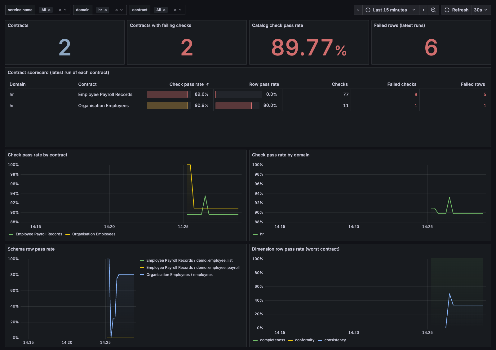

### Catalog view

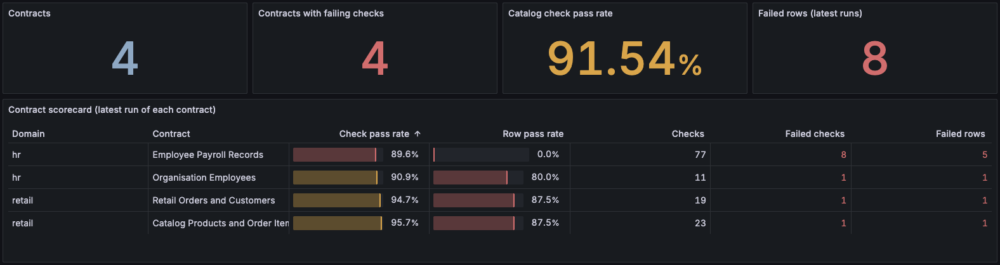

- **Contracts** is how many contracts sent at least one run in the time range.
- **Contracts with failing checks** counts contracts whose latest run had a
  check pass rate below 100%. Anything above 0 is red.
- **Catalog check pass rate** is passed checks divided by all checks, over the
  latest run of every contract. Big contracts weigh more than small ones.
- **Failed rows (latest runs)** adds up the failed rows of every contract's
  latest run.
- **Contract scorecard** has one row per contract, worst check pass rate
  first. Start here to decide which contract to look at. Pass rates show as a
  bar, and failed checks counts both FAILED and ERROR.

The colours are muted on purpose. A pass rate is green at 99% or more, amber
at 90% or more and red below that. A count turns red above 0. In this data
every contract has some failing checks on purpose, so the failure tiles are
red. The payroll contract shows a row pass rate of 0% because its tables
have only 2 and 3 rows and every row fails at least one check. On tiny tables
the row pass rate swings hard, so read it with the row counts.

### Trends

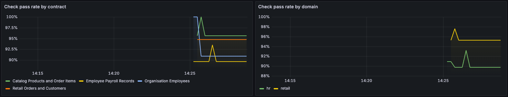

- **Check pass rate by contract** is one line per contract, one point per run.
- **Check pass rate by domain** adds up the checks of every contract in a
  domain, so it is the domain-wide pass rate, not an average of contracts.

Each dot is a Prometheus sample, not a run. Prometheus repeats the last value
of a series for up to 5 minutes, so after the last run the line stays flat for
a while and then stops. Use `--sleep 20` or more if you want each round to show
as its own point.

### Drill down into schemas and dimensions

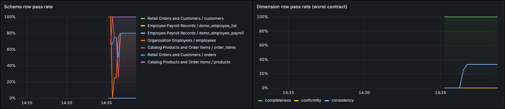

- **Schema row pass rate** is one line per contract and schema.
- **Dimension row pass rate (worst contract)** is one line per data quality
  dimension. It shows the lowest value across the selected contracts, so one
  bad contract is not hidden by the good ones. Pick a single contract to see
  its own numbers.

### Per check tables

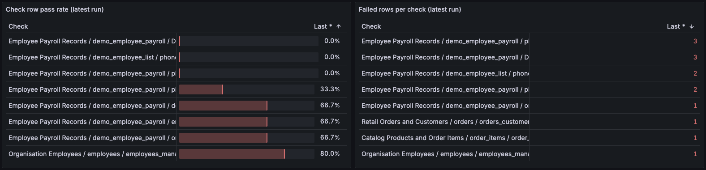

Both tables show the latest run of each contract. Each row is
`contract / schema / check (dimension)`.

- **Check row pass rate** lists checks from worst to best. A check below 100%
  failed at least one row.
- **Failed rows per check** lists checks by failed row count. Red numbers are the
  checks to fix.

### Traces and logs

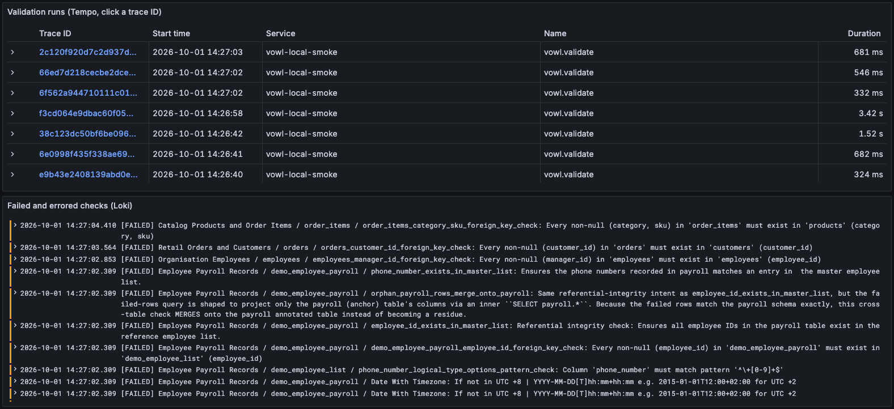

- **Validation runs** lists one `vowl.validate` trace per validation, filtered
  by the pickers. Click a trace ID to open it.
- **Failed and errored checks** shows one log line per failing check, formatted
  as `[status] contract / schema / check: message`. Failed checks log at WARN
  and errored checks at ERROR.

## Read a trace

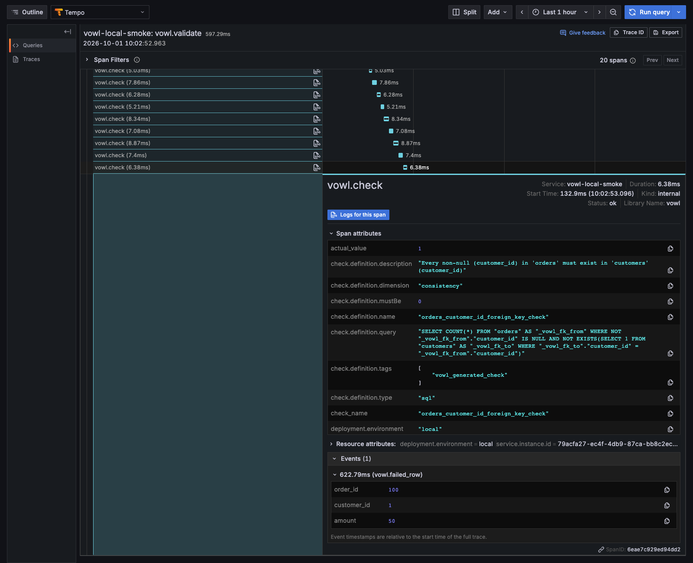

A trace is one validation run. The root `vowl.validate` span covers the whole
run and carries the run totals (`check.count.passed`, `check.count.failed`,
`check.pass_rate`). Under it is one `vowl.check` span per check, in the order
they ran. The bar length is how long that check's query took.

Click a `vowl.check` span to see its attributes:

- `check_name`, `schema_name`, `dimension` identify the check.
- `status` is the check result (PASSED, FAILED or ERROR). The span status stays
  `ok` for a FAILED check because the query itself ran fine.
- `row.count.failed`, `row.count.passed` and `row.pass_rate` are the check's
  row numbers, the same as `vowl.check.row.count` and
  `vowl.check.row.pass_rate`. A check that returns one number instead of rows
  has none.
- `expected_value`, `actual_value` and `operator` explain why it failed.
- `query` is the SQL that ran.
- **Events** hold a sample of failed rows (`vowl.failed_row`), one event per
  row. `send_sample_runs.py` sends up to 3 per check through
  `max_failed_rows_sample=3`. This is off by default because it sends real
  cell values.

Every check span has the same name, `vowl.check`, so you cannot tell checks
apart in the tree without opening them. To find the failed ones, search Tempo
in Grafana Explore with TraceQL:

```text
{ name = "vowl.check" && span.status = "FAILED" } | select(resource.vowl.contract.name, span.check_name, span.dimension, span.row.count.failed)
```

Set **Table Format** to **Spans** to get one row per failed check across all
runs and contracts. The contract attributes are resource attributes, so add
`&& resource.vowl.domain = "hr"` or `&& resource.vowl.contract.name = "..."` to
narrow it down:

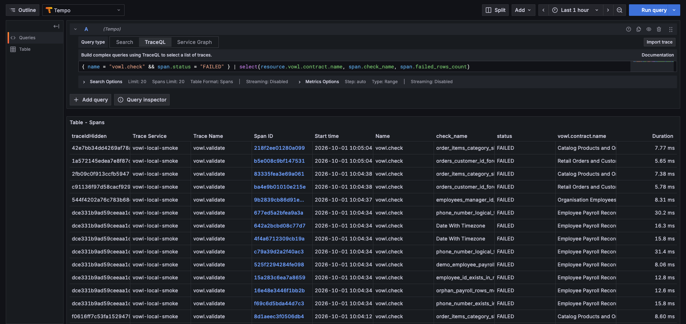

## Read a log record

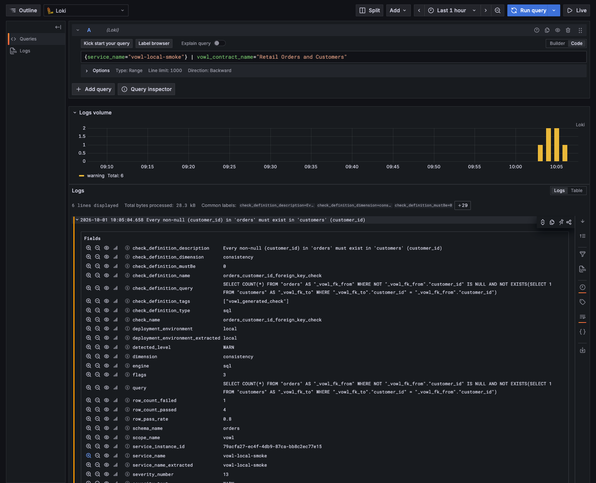

In Grafana Explore, pick Loki and run:

```text
{service_name="vowl-local-smoke"} | vowl_contract_name="Retail Orders and Customers"
```

Click a line to open its fields. The message is the check's description, and
the fields repeat the check details (`check_name`, `status`,
`failed_rows_count`, `query`). `trace_id` and `span_id` link the record to its
`vowl.check` span, so the **Tempo** link next to `trace_id` opens the trace for
that check.

The contract attributes (`vowl_contract_name`, `vowl_domain` and so on) are
structured metadata, not index labels. Filter them after the stream selector
with `| vowl_domain="hr"`, as above. Putting them inside `{...}` returns
nothing.

## Send your own runs

`make otel-add-vowl-runs` runs [`send_sample_runs.py`](send_sample_runs.py).
Pass options through `ARGS`:

```bash
make otel-add-vowl-runs ARGS="--runs 10 --sleep 20 --protocol http/protobuf --service-name my-test"
```

| Option           | Default            | Meaning                                                                   |
| ---------------- | ------------------ | ------------------------------------------------------------------------- |
| `--runs`         | 5 (from Makefile)  | Number of rounds. Each round validates every selected contract            |
| `--contracts`    | `all`              | Comma-separated keys from the catalog table, for example `payroll,retail` |
| `--sleep`        | 2.0                | Seconds between rounds                                                    |
| `--protocol`     | `grpc`             | `grpc` (port 4317) or `http/protobuf` (4318)                              |
| `--service-name` | `vowl-local-smoke` | `service.name` shown in the dashboard                                     |

To send a run from your own code, point `export_otel` at the collector:

```python
result.export_otel(endpoint="http://localhost:4317", service_name="my-test")
```

In Prometheus the metric names use underscores and carry a unit suffix. For
example `vowl.schema.row.pass_rate` becomes `vowl_schema_row_pass_rate_ratio`
and `vowl.run.check.count` becomes `vowl_run_check_count_total`.

## Troubleshooting

- **Nothing shows up.** Run `make otel-logs` while you send a run. The
  collector prints every metric, span and log record it receives. If it prints
  nothing, vowl did not reach it: check the endpoint and protocol.
- **Metrics show but traces or logs do not.** Check the collector output for
  export errors to Tempo or Loki.
- **The dashboard is empty but data arrived.** Widen the time range. The
  dashboard shows the last hour by default.

## Known limitation: check counts do not add up across runs

Each call to `export_otel` without your own provider starts a new stream of
data in the collector, so the collector cannot add one run's counts to the
last one's. In Prometheus, `vowl_*_check_count_total` holds the latest run's
counts, and `increase(...)` over several runs returns 0. The dashboard reads
the counts as "checks in the latest run" for this reason. The row counts and
pass rates are gauges and are not affected.

## Change the dashboard

The dashboard is generated by
[`grafana/build_dashboard.py`](grafana/build_dashboard.py). Edit it, then run:

```bash
make otel-dashboard
```

Grafana reloads `grafana/dashboards/vowl-dq.json` within a few seconds.
